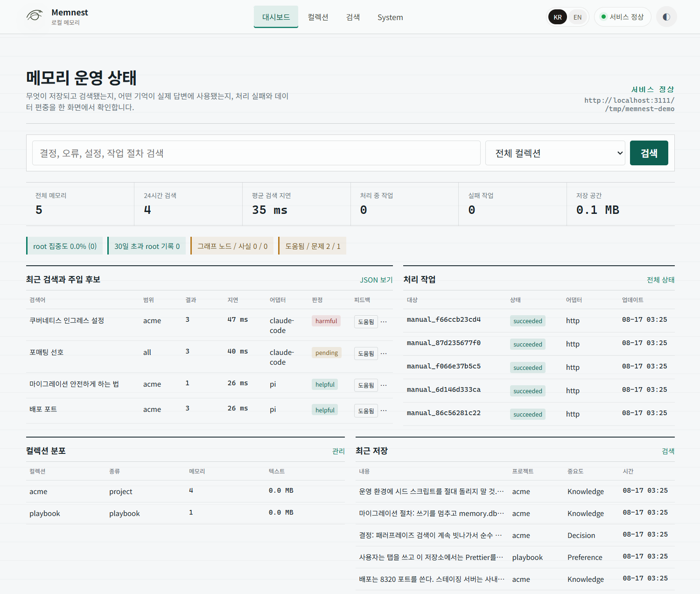

# memnest

<!-- markdownlint-disable MD013 -->

[English README](README.md)

AI 코딩 에이전트를 위한 로컬 메모리입니다. 프로젝트 기억과 검색 가능한 대화 원문을 내 컴퓨터에 저장하고, pi, Claude Code, Codex, MCP 클라이언트에 같은 툴 계약을 제공합니다.

[](./LICENSE)




## 하는 일

- 직접 저장한 기억, 프로젝트 결정, 선호, 교정 내용을 보관합니다.
- 로컬 BM25와 HNSW 벡터 색인으로 검색합니다.
- 사용자와 어시스턴트의 대화 원문을 LLM 요약 없이 검색 가능하게 저장합니다.
- 어떤 검색 결과가 도움이 됐는지 기록해 다음 검색 순위에 반영합니다.
- 자격증명은 AES-256-GCM으로 암호화하는 별도 금고에 보관합니다.

Rust 코어는 LLM을 호출하지 않습니다. 임베딩은 `intfloat/multilingual-e5-base` 모델로 로컬에서 처리합니다.

## 설치

```bash
git clone https://github.com/Blue-B/memnest.git
cd memnest/core
cargo build --release
install -m755 target/release/memnest ~/.local/bin/memnest
memnest --data-dir ~/.memnest
```

서비스, 대시보드, HTTP API, Streamable HTTP MCP가 같은 주소를 사용합니다.

```text
http://127.0.0.1:3111
http://127.0.0.1:3111/mcp
```

서비스를 켜는 것만으로는 아무것도 내려받지 않습니다. 임베딩 모델은 처음 저장하거나 처음 검색할 때, 즉 임베딩이 실제로 필요한 첫 요청에서 내려받습니다. 그래서 그 요청만 유독 오래 걸립니다. `memnest --warmup-embedding`으로 미리 받아 둘 수 있습니다. Linux, WSL, Windows 서비스 설정과 백업, 복구, 보존 정책은 [`docs/operations.md`](docs/operations.md)에 있습니다.

## 에이전트 연결

### MCP

실행 중인 서비스 주소를 MCP 클라이언트에 등록합니다.

```json
{
  "mcpServers": {
    "memnest": { "url": "http://127.0.0.1:3111/mcp" }
  }
}
```

여러 클라이언트가 서버와 데이터 디렉터리 하나를 공유할 수 있는 Streamable HTTP 방식을 권장합니다. stdio는 클라이언트 하나가 저장소를 단독으로 쓸 때만 사용합니다.

```json
{
  "mcpServers": {
    "memnest": {
      "command": "/absolute/path/to/memnest",
      "args": ["--mcp", "--data-dir", "/home/you/.memnest"]
    }
  }
}
```

### pi

```bash
cd memnest/pi-extension
npm install
pi install .
```

pi 확장은 같은 툴을 등록하고, 프로젝트 범위 Autocontext와 상태 확인용 `/memnest`를 추가합니다. 자세한 내용은 [`pi-extension/README.md`](pi-extension/README.md)에 있습니다.

### HTTP와 직접 연동

MCP 없이 HTTP API만 사용할 수도 있습니다. [`adapters/generic-http`](adapters/generic-http)에 의존성 없는 JSONL 참조 어댑터가 있습니다.

## 툴 계약

모든 호스트에서 메모리 툴 6개를 사용합니다.

```text
memory_remember
memory_search
memory_get
memory_update
memory_delete
memory_feedback
```

금고가 초기화되면 시크릿 툴 4개가 추가됩니다.

```text
secret_set
secret_get
secret_list
secret_delete
```

검색은 프로젝트 범위로 동작합니다. 클라이언트는 프로젝트를 지정하거나 `project=all`을 명시해야 합니다. 모든 검색은 `recall_id`를 반환합니다. `recall_id`와 `memory_id`를 함께 보낸 피드백은 그 검색 결과 하나에만 반영됩니다. 삭제한 기억은 바로 지우지 않고 휴지통으로 이동합니다.

### 프로젝트는 디렉터리 이름으로 구분합니다

프로젝트 이름은 전체 경로가 아니라 작업 디렉터리의 마지막 이름입니다. 그래서 `/work/client-a/api`와 `/personal/api`는 둘 다 `api` 프로젝트가 되고, 아무 경고 없이 서로의 기억을 함께 읽고 씁니다. 지금은 디렉터리 이름을 다르게 두거나 호출할 때마다 `project`를 직접 지정해서 피해야 합니다. 전체 경로를 구분하는 방식으로 바꿀 계획입니다.

## 자동 컨텍스트와 대화 저장

`memnest hook`은 호스트의 프롬프트 이벤트를 stdin으로 읽고, 현재 프로젝트와 관련된 짧은 컨텍스트를 출력합니다. 작업 디렉터리를 알 수 없거나 서비스가 꺼져 있으면 아무것도 출력하지 않고 프롬프트를 막지 않습니다.

Claude Code 설정 예시입니다.

```json
{
  "hooks": {
    "UserPromptSubmit": [
      {
        "hooks": [
          { "type": "command", "command": "memnest hook" }
        ]
      }
    ]
  }
}
```

`memnest watch`는 pi, Claude Code, Codex 대화를 저장하는 단일 경로입니다.

```bash
memnest watch
memnest watch --once
memnest watch --backfill
```

자격증명을 가린 뒤 사용자와 어시스턴트에게 보이는 텍스트만 저장합니다. system 및 developer 프롬프트, reasoning, reminder, 툴 호출과 결과, 이미지, 서브에이전트 내부 대화는 제외합니다. 긴 대화는 순서가 있는 검색 청크로 나눕니다. 같은 말을 여러 번 했으면 각각 저장하고, 같은 transcript 이벤트의 재시도만 중복으로 처리합니다.

watcher는 알려진 transcript 디렉터리를 감시하고 `<data-dir>/watch-state.json`에 파일별 위치를 기록합니다. 모든 청크가 저장되거나 복구된 뒤에만 위치가 전진합니다. 기본값은 새 대화부터 읽으며, 기존 기록을 가져오려면 `--backfill`을 사용합니다.

## 저장 구조와 대시보드

기본 데이터 디렉터리는 `~/.memnest`입니다.

```text
memory.db       SQLite 레코드와 메타데이터
text_index/     Tantivy BM25 색인
vectors/        HNSW 벡터 색인
models/         로컬 임베딩 모델
master.key      금고 키
archive/        완전 삭제된 기억의 평문 JSONL
watch-state.json
```

`http://127.0.0.1:3111` 대시보드에서 저장된 기억, 검색 기록, 지연, 처리 실패, 회상 피드백을 확인할 수 있습니다.

## 보안

서버는 기본적으로 `127.0.0.1`에 바인딩합니다. `MEMNEST_TOKEN`이 비어 있으면 외부 주소 바인딩을 거부합니다. 토큰을 설정한 경우 클라이언트는 `Authorization: Bearer <token>`을 보내야 합니다.

일반 메모리 텍스트는 로컬에 저장되지만 저장 시 암호화되지는 않습니다. 자격증명처럼 보이는 문자열을 저장 전에 가리지만, 비밀값은 검색 메모리가 아니라 금고에 넣어야 합니다. 새 저장소는 `<data-dir>/master.key`를 만들고 금고 값을 AES-256-GCM으로 암호화합니다. 기존 금고를 현재 키로 복호화할 수 없으면 시작 단계에서 실패합니다. 평문으로 대신 반환하는 경로는 어디에도 없으니, 키는 데이터 디렉터리와 별도로 백업해 두세요.

삭제는 완전 삭제가 아닙니다. 지운 기억은 30일 동안 휴지통에 남고, 휴지통에서 최종 삭제될 때 레코드 전체가 `<data-dir>/archive/YYYY-MM.jsonl`에 평문으로 기록됩니다. `MEMNEST_ARCHIVE=0`으로 이 파일 기록을 끌 수 있고, 이미 쌓인 `archive/` 디렉터리는 직접 지워야 합니다.

3111 포트를 인터넷에 직접 공개하지 마세요. 나머지 보안 내용은 [`SECURITY.md`](SECURITY.md)에 있습니다.

## 저장소 구성

| 디렉터리 | 역할 |
| --- | --- |
| [`core/`](core) | Rust 서버, CLI, 색인, MCP, 금고, watcher, 대시보드 |
| [`pi-extension/`](pi-extension) | 얇은 pi 어댑터와 프로젝트 범위 Autocontext |
| [`adapters/`](adapters) | 연동 계약과 일반 HTTP 어댑터 |
| [`journal/`](journal) | 선택 기능인 Markdown 및 git 감사 미러, 데이터베이스 백업은 아님 |

개발 검사 명령입니다.

```bash
(cd core && cargo test --locked -- --test-threads=1)
(cd pi-extension && npm install && npm run build && npm run smoke)
(cd adapters/generic-http && node test.mjs)
```

엔진 의존성 고지는 [`core/THIRD_PARTY_NOTICES.md`](core/THIRD_PARTY_NOTICES.md)에 있습니다. 기여 방법은 [`CONTRIBUTING.md`](CONTRIBUTING.md)를 따릅니다.

## 라이선스

MIT © Blue-B
