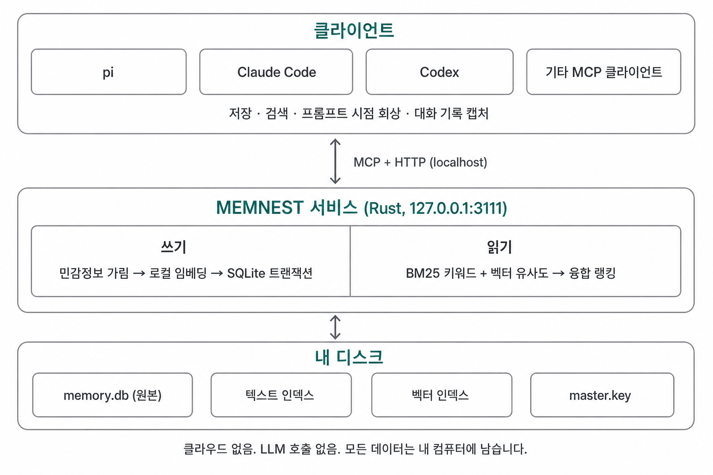
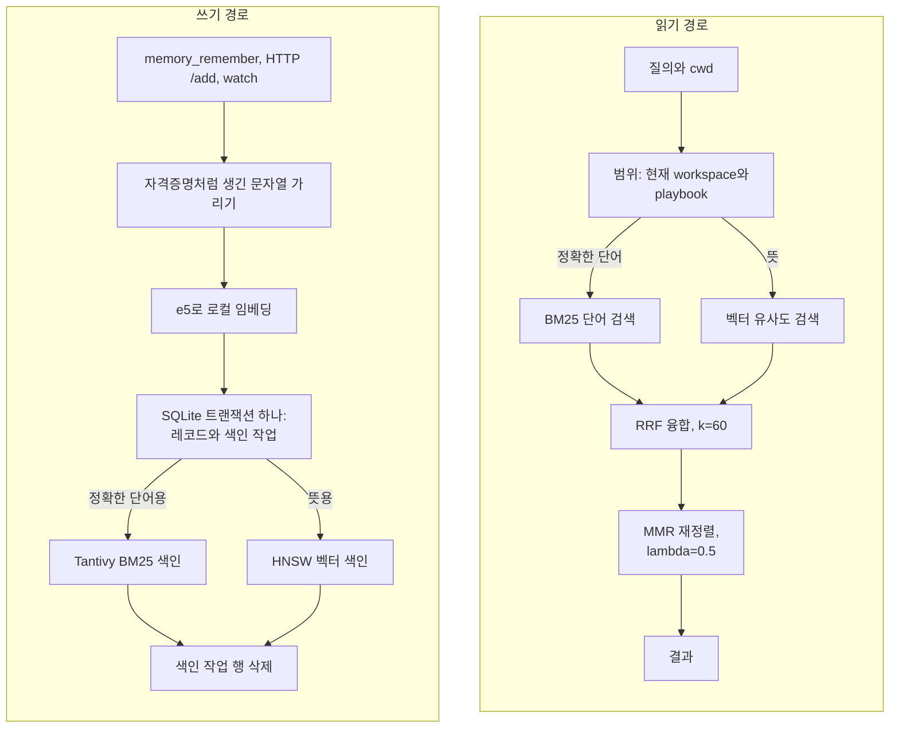
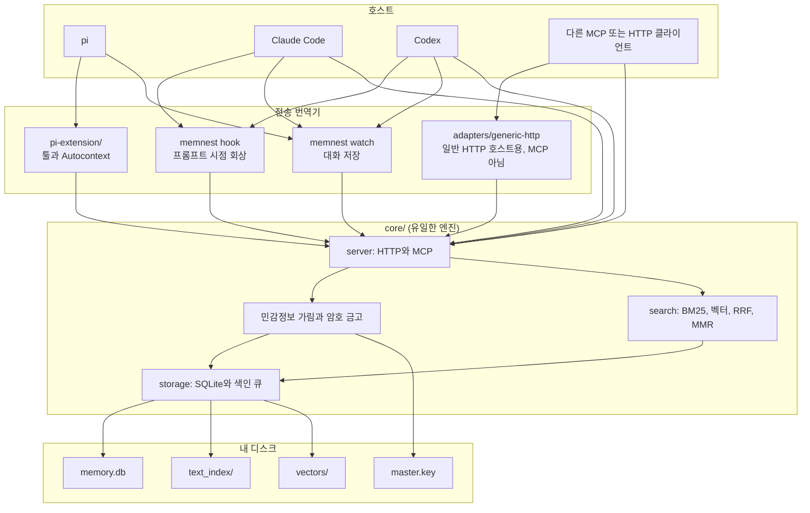

# memnest

<!-- markdownlint-disable MD013 -->

[English README](./README.md)

AI 코딩 에이전트는 세션이 끝나면 전부 잊습니다. memnest는 그 기억을 내 컴퓨터에 남겨 다음 세션에 돌려주고, pi와 Claude Code, Codex, 다른 MCP 클라이언트가 모두 같은 툴 계약으로 꺼내 쓰게 합니다.

[](./LICENSE)


[](https://www.npmjs.com/package/pi-memnest)



## 무엇을 해주나

| 기능 | 설명 |
| --- | --- |
| 기억 보관 | 결정, 선호, 교정처럼 의도해서 남긴 내용을 저장합니다. 대화 로그를 통째로 붓지 않습니다. |
| 대화 기록 | 사용자와 어시스턴트의 발언을 자격증명만 가린 원문 그대로, LLM 요약 없이 검색 가능하게 둡니다. |
| 하이브리드 검색 | 두 종류 모두를 로컬 BM25 단어 검색과 벡터 유사도로 함께 찾습니다. workspace나 project 범위 검색은 범위 안의 모든 기억을 질의와 하나씩 정확히 비교하고, 전체 검색(`project=all`)은 HNSW 색인을 사용합니다. |
| 프로젝트 분리 | 폴더 하나의 기억은 그 workspace 안에 머물고, `playbook`이 전역 공유 규칙을 맡습니다. |
| 비밀 금고 | 자격증명은 AES-256-GCM 저장소에 두어 검색 대상과 분리합니다. |

`CLAUDE.md`나 `AGENTS.md` 같은 마크다운 노트 파일은 이 중에서 에이전트가 매번 읽는 짧은 규칙 목록에 해당하는 부분을 이미 담당합니다. 파일이 커지는 순간부터 나머지는 감당하지 못합니다. 파일은 통째로 읽거나 아예 읽지 않는 둘 중 하나라서 질의 시점의 검색이 없고, 저장소마다 파일 하나라서 workspace 분리가 없으며, 대화는 직접 붙여 넣은 것만 남고, 적어 둔 API 키를 가려 주는 장치가 없고, 고쳐 쓴 줄이 예전 줄을 덮어써서 사실이 바뀌었다는 기록이 남지 않습니다.

도구 호출과 프롬프트 시점 회상, 대화 캡처는 하나의 Rust 서비스가 서로 다른 데이터 경로로 처리합니다. 원본은 SQLite이고 옆에 있는 Tantivy, HNSW 색인은 지워도 다시 만들 수 있습니다. 어느 단계에서도 LLM을 호출하지 않으며 임베딩은 `intfloat/multilingual-e5-base`로 로컬에서 돌아갑니다.

## 기억이 오가는 경로

쓰기와 읽기는 같은 저장소를 쓰지만 경로가 다릅니다. 쓰기는 검색 가능해지기 전에 먼저 durable해지고, 읽기는 서로 독립적인 두 순위를 합쳐서 어느 한쪽만 믿지 않습니다.



색인을 둘 다 만드는 것은 약점이 서로 다르기 때문입니다. BM25는 포트 번호나 패키지 이름 같은 정확한 문자열을 잡지만 달리 표현한 문장은 못 찾습니다. 벡터 검색은 표현이 달라도 찾아내지만 정작 입력한 그 단어를 빗나가기도 합니다. 어느 쪽이 필요할지는 검색해봐야 알 수 있어서 저장할 때 둘 다 만들어둡니다. 다만 두 결과를 합치는 방식은 대칭이 아닙니다. 범위 안에서 단어 색인이 하나라도 걸리면 뜻으로만 찾은 후보는 버립니다. 질의와 겹치는 단어가 없는 결과는 단어 검색이 아무것도 못 찾았을 때만 올라옵니다.

색인 작업 행이 있어서 색인이 사라져도 복구됩니다. 레코드와 같은 트랜잭션에 기록되고 두 색인이 모두 durable해진 뒤에야 지워지므로, 중간에 끊긴 쓰기는 유실되지 않고 시작할 때 다시 반영됩니다.


## 설치

Linux x86_64와 aarch64에서는 Rust 없이 최신 릴리스를 설치할 수 있습니다. 스크립트가 아카이브 checksum을 확인하고 바이너리와 사용자 systemd 서비스를 설치한 뒤 상태를 검사합니다.

```bash
curl -fsSL https://raw.githubusercontent.com/Blue-B/memnest/main/core/scripts/install.sh \
  -o /tmp/memnest-install.sh
bash /tmp/memnest-install.sh --user
```

실행하기 전에 내려받은 스크립트를 확인하세요. `sudo`를 사용하는 시스템 서비스가 필요하면 `--system`을 사용합니다.

소스에서 빌드하려면 Git과 2024 edition을 지원하는 Rust 툴체인이 필요합니다. 빌드된 바이너리를 실행할 때는 둘 다 필요하지 않습니다.

```bash
git clone https://github.com/Blue-B/memnest.git
cd memnest/core
cargo build --release
install -m755 target/release/memnest ~/.local/bin/memnest
memnest --data-dir ~/.memnest
```

마지막 줄은 서비스를 포그라운드로 띄웁니다. 백그라운드 서비스로 등록하려면 방금 빌드한 바이너리를 설치 스크립트에 넘깁니다.

```bash
cd .. && core/scripts/install-linux.sh --user --bin core/target/release/memnest
```

Windows와 WSL은 같은 디렉터리의 `install-windows.ps1`, `install-wsl.ps1`을 사용합니다.

삭제는 그 옆에 있는 짝 스크립트로 합니다. 서비스를 멈추고 바이너리를 지우며, 따로 요청하지 않으면 데이터 디렉터리는 건드리지 않습니다.

```bash
core/scripts/uninstall-linux.sh --user
core/scripts/uninstall-linux.sh --user --remove-data
```

`--remove-data`는 데이터 디렉터리를 통째로 지웁니다. `--user` 설치는 `~/.memnest`, `--system` 설치는 `/var/lib/memnest`가 대상입니다. `memory.db`와 `master.key`, 색인 두 개, 모델 캐시, 아카이브 JSONL이 함께 사라집니다. 직접 만들어 둔 백업 말고는 남는 것이 없습니다. `uninstall-windows.ps1`과 `uninstall-wsl.ps1`은 같은 동작을 `-RemoveData`로 받습니다.

서비스 자체를 npm으로 설치하지는 않습니다. npm 패키지 `pi-memnest`는 이 서비스에 붙는 pi 확장이라서 서비스가 먼저 떠 있어야 합니다. 아래 [pi](#pi) 항목을 참고하세요.

HTTP API와 Streamable HTTP MCP 엔드포인트가 주소 하나를 공유합니다.

```text
http://127.0.0.1:3111        HTTP API
http://127.0.0.1:3111/mcp    MCP 엔드포인트
```

서비스를 켜는 것만으로는 아무것도 내려받지 않습니다. 임베딩 모델은 실제로 필요한 첫 요청, 그러니까 처음 저장하거나 처음 검색할 때 내려받아서 그 요청만 유독 오래 걸립니다. `memnest --warmup-embedding`으로 미리 받아 둘 수 있습니다. 이 명령은 서비스와 같은 데이터 디렉터리 배타 writer 잠금을 잡으므로, 서비스를 켜기 전에 실행하거나 서비스를 멈춘 뒤에 실행해야 합니다.

이 모델은 작지 않습니다. 기본값인 `intfloat/multilingual-e5-base`는 `models/`에 약 1.1 GB를 쓰고, 임베딩하는 동안 상주 메모리가 1.9 GB 근처까지 올라갑니다. 그만큼을 내주기 어려운 컴퓨터라면 첫 저장 전에 더 작은 모델을 고르세요.

```bash
MEMNEST_EMBED_MODEL=intfloat/multilingual-e5-small
MEMNEST_EMBED_DIM=384
```


현재 버전은 `0.1.0`입니다. 테스트와 위 벤치마크가 덮는 부분은 저장 형식과 툴 이름 5개, HTTP 경로이고, 업그레이드는 이 셋을 지키는 데 가장 공을 들입니다. 응답 필드 이름과 환경 변수 기본값, 순위 가중치는 그 범위 밖이라 패치 릴리스에서도 바뀔 수 있습니다. 업그레이드 전에 `memory.db`와 `master.key`를 백업하세요.

## 에이전트 연결

호스트마다 열어 준 확장 지점이 달라서 연결 방법은 갈리지만, 서비스와 데이터, 툴 계약은 하나로 유지됩니다:

| 하네스 | 프롬프트 시점 회상 | 메모리 툴 | 대화 저장 |
| --- | --- | --- | --- |
| pi | 확장이 제공하는 Autocontext | 확장이 툴 5개를 등록 | `memnest watch` |
| Claude Code | `UserPromptSubmit`에서 `memnest hook` | MCP | `memnest watch` |
| Codex | `UserPromptSubmit`에서 `memnest hook` | MCP | `memnest watch` |
| 다른 MCP 클라이언트 | 클라이언트 기능에 따름 | MCP | 해당 없음 |

아래 섹션이 각 경로의 설정 방법입니다.

### MCP

실행 중인 서비스 주소를 MCP 클라이언트에 등록합니다.

```json
{
  "mcpServers": {
    "memnest": { "url": "http://127.0.0.1:3111/mcp" }
  }
}
```

여러 클라이언트가 서버와 데이터 디렉터리 하나를 공유할 수 있는 Streamable HTTP 방식을 권장합니다. stdio는 그 프로세스가 저장소를 단독으로 쓸 때만 사용합니다. 같은 데이터 디렉터리를 열려는 두 번째 writer는 색인을 덮어쓰지 못하도록 바로 거부됩니다.

```json
{
  "mcpServers": {
    "memnest": {
      "command": "/absolute/path/to/memnest",
      "args": ["--mcp", "--data-dir", "/home/you/.memnest"]
    }
  }
}
```

### pi

```bash
pi install npm:pi-memnest
```

npm 패키지에는 pi 어댑터만 있고 메모리 엔진은 없으므로 core 서비스를 먼저 실행해야 합니다. pi 확장은 메모리 툴 5개와 workspace 범위 Autocontext, 상태 확인용 `/memnest`를 추가합니다. 금고 툴은 선택해서 켭니다. 자세한 내용은 [`pi-extension/README.md`](pi-extension/README.md)에 있습니다.

### HTTP와 직접 연동

MCP 없이 HTTP API만 사용할 수도 있습니다. [`adapters/generic-http`](adapters/generic-http)에 의존성 없는 JSONL 참조 어댑터가 있습니다.

기억 하나를 저장하고 다시 찾아오는 과정입니다. 저장할 때는 그 기억이 속한 작업 디렉터리를 같이 보냅니다.

```bash
curl -s -X POST http://127.0.0.1:3111/add \
  -H 'Content-Type: application/json' \
  -d '{
    "text": "The staging database listens on port 5433, not 5432.",
    "cwd": "/home/you/projects/api",
    "metadata": { "chunk_type": "manual", "importance": "knowledge" }
  }'
```

```json
{"status":"succeeded","id":"manual_dad95c8fe81d4ea0a952a92be92bc396","project":"ws_api_66be38887e291f20c873e9a0954b4e0b","job_id":"job_f9869554c08f457582df0a658f889187","adapter":"http"}
```

같은 텍스트를 다시 보내면 새 id를 만들지 않고 `"status":"deduplicated"`와 기존 `id`를 돌려줍니다.

돌려받은 `project`는 `cwd`에서 파생한 해시 workspace ID이지 직접 고른 이름이 아닙니다. 같은 `cwd`로 검색하면 질의가 저장된 문장을 그대로 반복하지 않아도 됩니다.

```bash
curl -s -X POST http://127.0.0.1:3111/search \
  -H 'Content-Type: application/json' \
  -d '{
    "query": "which port does staging postgres use",
    "cwd": "/home/you/projects/api",
    "n_results": 3
  }'
```

```json
{"results":[{"id":"manual_dad95c8fe81d4ea0a952a92be92bc396","project":"ws_api_66be38887e291f20c873e9a0954b4e0b","document":"The staging database listens on port 5433, not 5432.","doc_len":52,"score":0.28333306,"timestamp":"2026-08-30T12:40:23.796400433+00:00","chunk_type":"Manual","importance":"Knowledge","category":"General","memory_kind":"record","confidence":null,"adapter":"http"}],"project":"ws_api_66be38887e291f20c873e9a0954b4e0b","total":1,"elapsed_ms":21}
```

`score`는 순위 계산의 합성값이지 그 기억이 관련 있을 확률이 아닙니다. `doc_len`이 돌려받은 `document` 길이보다 크면 발췌가 잘렸다는 뜻이고, 나머지는 `GET /chunk/{id}`로 가져옵니다.

## 툴 계약

모든 호스트에서 메모리 툴 5개를 사용합니다.

```text
memory_remember
memory_search
memory_get
memory_update
memory_delete
```

로컬 금고 API는 초기화되지만 모델용 시크릿 툴은 기본적으로 숨깁니다. 신뢰하는 에이전트 프로세스에서 `MEMNEST_EXPOSE_SECRET_TOOLS=1`을 설정하면 다음 4개가 추가됩니다.

```text
secret_set
secret_get
secret_list
secret_delete
```

검색은 workspace 범위로 동작합니다. 클라이언트는 절대 경로인 `cwd`, 명시적인 `project`, 또는 의도적인 전체 검색인 `project=all`을 보냅니다. 삭제한 기억은 바로 지우지 않고 휴지통으로 이동합니다.

### workspace를 식별하는 방식

자동으로 만든 workspace ID는 정규화한 작업 디렉터리 절대 경로의 안정적인 해시라서 경로 원문이 공개 collection 이름으로 드러나지 않습니다. `/work/client-a/api`와 `/personal/api`는 서로 다른 workspace이며, 자동 검색은 현재 workspace와 `playbook`을 읽습니다.

폴더 이름을 따른 기존 collection은 그 이름을 쓰는 등록 workspace가 하나일 때만 호환 별칭으로 읽습니다. 두 번째 `api` workspace가 나타나는 순간, 기존 행의 소유자를 추측하는 대신 두 쪽 모두에서 모호한 별칭을 끕니다. 이름을 직접 관리하는 기존 collection을 쓸 때는 `project`를 명시하면 됩니다.

### 기억을 교체할 때

`supersedes=<id>`로 저장한 기억은 같은 범위의 활성 기억만 교체할 수 있습니다. 새 기억 저장과 기존 행의 `_superseded` 이동은 SQLite 트랜잭션 하나에서 처리합니다.

semantic content dedup은 가장 단순한 저장 하나에만 적용합니다. category가 general인 manual knowledge 기록이면서 confidence, source, role, tool, `source_ids`, `supersedes`, `verified_at`이 모두 비어 있는 경우입니다. 구조화한 fact와 rule, 출처, 교정처럼 무엇이든 메타데이터를 달고 온 저장은 그 값이 사라지지 않도록 dedup을 건너뜁니다. `confidence`와 `verified_at`은 클라이언트가 보낸 주장으로 남으며 검색 순위를 자동으로 높이지 않습니다.

저장한 기억이 낡았다는 것은 memnest가 알아채지 못합니다. staging이 5433 포트를 쓴다고 저장해 두고 다음 주에 포트를 바꿔도 memnest는 계속 5433을 돌려줍니다. 순위 계산은 나이에 따라 점수를 깎고 중요도와 기억 종류에 따라 점수를 더할 뿐, 그 텍스트가 아직 사실인지는 검사하지 않습니다. 서비스는 코드를 읽지 않고 모델도 호출하지 않기 때문입니다. 교체는 호출하는 쪽의 몫이라, 바뀐 것을 알아챈 사람이 `supersedes=<id>`로 새 사실을 저장해야 합니다. 그때까지 낡은 행은 계속 검색되고, 맞는 기억과 똑같이 믿을 만해 보입니다.

## 자동 컨텍스트와 대화 저장

`memnest hook`은 호스트의 프롬프트 이벤트를 stdin으로 읽고, 현재 workspace와 관련된 짧은 컨텍스트를 출력합니다. 작업 디렉터리를 알 수 없거나 서비스가 꺼져 있으면 아무것도 출력하지 않고 프롬프트를 막지 않습니다. 검색 텍스트는 신뢰하지 않는 참고자료로 표시합니다. transcript 결과는 과거 대화 증거로 따로 표시하고, 주입 전에 포함된 markup을 escape합니다.

Claude Code와 Codex는 같은 훅 형식을 쓰므로 설정도 동일합니다. Claude Code는 `~/.claude/settings.json`에, Codex는 `~/.codex/hooks.json` 또는 `config.toml`의 `[hooks]`에 둡니다.

```json
{
  "hooks": {
    "UserPromptSubmit": [
      {
        "hooks": [
          { "type": "command", "command": "memnest hook" }
        ]
      }
    ]
  }
}
```

Codex는 새로 추가하거나 수정한 훅을 `/hooks`에서 검토하고 신뢰 처리해야 실행합니다.

`memnest watch`는 pi, Claude Code, Codex 대화를 저장하는 단일 경로입니다.

```bash
memnest watch
memnest watch --once
memnest watch --backfill
```

자격증명을 가린 뒤 사용자와 어시스턴트에게 보이는 텍스트만 저장합니다. system 및 developer 프롬프트, reasoning, reminder, 툴 호출과 결과, 이미지, 서브에이전트 내부 대화는 제외합니다. 긴 대화는 순서가 있는 검색 청크로 나눕니다. 같은 말을 여러 번 했으면 각각 저장하고, 같은 transcript 이벤트의 재시도만 중복으로 처리합니다.

watcher는 알려진 transcript 디렉터리를 감시하고 `<data-dir>/watch-state.json`에 파일별 위치를 기록합니다. 모든 청크가 저장되거나 복구된 뒤에만 위치가 전진합니다. 기본값은 새 대화부터 읽으며, 기존 기록을 가져오려면 `--backfill`을 사용합니다.

얼마나 오래 남는지는 무엇이 썼는지에 따라 갈립니다. 이렇게 저장한 대화 기록은 만료되지 않고, 수동 기억과 통합 기억, knowledge와 decision, preference로 표시한 기억도 마찬가지입니다. transcript 이벤트 식별자가 생기기 전에 기록된 옛 AutoLog 행은 30일 뒤에 만료되고(`MEMNEST_TTL_AUTOLOG_DAYS`), filtered 행은 7일 뒤입니다. 고정한 기억은 둘 다 적용받지 않습니다. 이 정리 작업은 HTTP 서비스에서만 돌기 때문에 stdio `--mcp` 프로세스만 띄운 환경에서는 아무것도 만료되지 않습니다. 만료는 `_trash`로 옮기는 것이라 30일 동안 id로 되살릴 수 있고, 그 뒤 완전 삭제될 때 레코드가 아카이브 JSONL에 덧붙습니다. 복구와 정리 명령은 [`docs/operations.md`](docs/operations.md)에 있습니다.

## 저장 구조

기본 데이터 디렉터리는 `~/.memnest`입니다.

```text
memory.db       SQLite 원본: 기억, workspace 등록 정보, 암호화된
                secrets 테이블, 대기 중인 색인 작업
                (서비스가 떠 있는 동안 -wal, -shm 파일이 옆에 생깁니다)
text_index/     memory.db에서 파생된 Tantivy BM25 단어 색인
vectors/        e5 임베딩을 올린 HNSW 색인, 전체 검색이 사용하며
                memory.db에서 파생
models/         로컬 임베딩 모델
master.key      secrets 테이블을 복호화하는 키
archive/        완전 삭제된 기억의 평문 JSONL
audit.log       TTL 만료, 휴지통 정리, /prune마다 덧붙는 JSON 라인
watch-state.json
```

`~/.memnest`가 없고 `~/.factory/memories`가 있으면 그 예전 디렉터리를 기본값으로 사용합니다.

원본은 `memory.db` 하나뿐입니다. 두 색인은 캐시라서 저장이 먼저 SQLite에 기록되고, 대기 중인 색인 작업이 `text_index/`와 `vectors/`를 갱신합니다. 두 디렉터리 중 하나를 지워도 서비스가 데이터베이스에서 다시 만들므로 안전합니다. `memory.db`는 다시 만들 수 없으니 `master.key`와 함께 백업하세요. 키 없이는 secrets 테이블을 복호화할 수 없습니다.

서비스 상태는 JSON으로 읽을 수 있습니다. `/health`는 생존 여부와 마지막 정리 작업을, `/stats`는 collection 크기와 디스크 사용량, 서비스를 켠 뒤의 검색 지연을 돌려줍니다. 질의 원문은 저장하지 않으므로 무엇을 검색했는지는 디스크에 남지 않습니다.

## 보안

서버는 기본적으로 `127.0.0.1`에 바인딩합니다. `MEMNEST_TOKEN`이 비어 있으면 외부 주소 바인딩을 거부합니다. 토큰을 설정한 경우 클라이언트는 `Authorization: Bearer <token>`을 보내야 합니다.

일반 메모리 텍스트는 로컬에 저장되지만 저장 시 암호화되지는 않습니다. 가림 처리는 미리 정해 둔 토큰 형태만 잡습니다. OpenAI 키, Slack 토큰, GitHub 토큰, AWS access key ID, PEM 블록, Google API 키, 그리고 `key: value` 형태 하나입니다. 비밀번호가 들어간 접속 문자열이나 JWT, 엔트로피만 높은 임의 문자열은 그대로 저장됩니다. 그래서 비밀값은 검색 메모리가 아니라 금고에 넣어야 합니다. 기존 `raw_chunk` 필드는 공개 메모리 작업으로 쓸 수 없습니다. 새 저장소는 비공개 권한으로 `<data-dir>/master.key`를 만들고 AES-256-GCM을 사용합니다. 새 암호문은 secret key 또는 server 이름에 묶이며 기존 `$enc$` 행도 계속 읽을 수 있습니다. 저장된 암호문이 현재 키와 맞지 않으면 시작 단계에서 실패합니다. `master.key`는 별도로 백업해 두세요.

삭제는 완전 삭제가 아닙니다. 지운 기억은 30일 동안 휴지통에 남고, 휴지통에서 최종 삭제될 때 레코드 전체가 `<data-dir>/archive/YYYY-MM.jsonl`에 평문으로 기록됩니다. `MEMNEST_ARCHIVE=0`으로 이 파일 기록을 끌 수 있고, 이미 쌓인 `archive/` 디렉터리는 직접 지워야 합니다.

3111 포트를 인터넷에 직접 공개하지 마세요. 나머지 보안 내용은 [`SECURITY.md`](SECURITY.md)에 있습니다.

## 저장소 구성

| 디렉터리 | 역할 |
| --- | --- |
| [`core/`](core) | Rust 서버, CLI, 색인, MCP, 금고, watcher |
| [`pi-extension/`](pi-extension) | 얇은 pi 어댑터와 workspace 범위 Autocontext |
| [`adapters/`](adapters) | 연동 계약과 일반 HTTP 어댑터 |

엔진은 `core/` 하나뿐입니다. 그 위는 전부 전송 번역기고, 그 아래는 내 디스크의 파일입니다.



개발 검사 명령입니다.

```bash
(cd core && cargo test --locked -- --test-threads=1)
(cd pi-extension && npm install && npm run build && npm run smoke)
(cd adapters/generic-http && node test.mjs)
```

엔진을 왜 이렇게 만들었는지, 무엇을 버렸는지는 [`docs/design-decisions.md`](docs/design-decisions.md)에 있습니다. 엔진 의존성 고지는 [`core/THIRD_PARTY_NOTICES.md`](core/THIRD_PARTY_NOTICES.md)에 있습니다. 기여 방법은 [`CONTRIBUTING.md`](CONTRIBUTING.md)를 따릅니다.

## 라이선스

MIT © Blue-B
