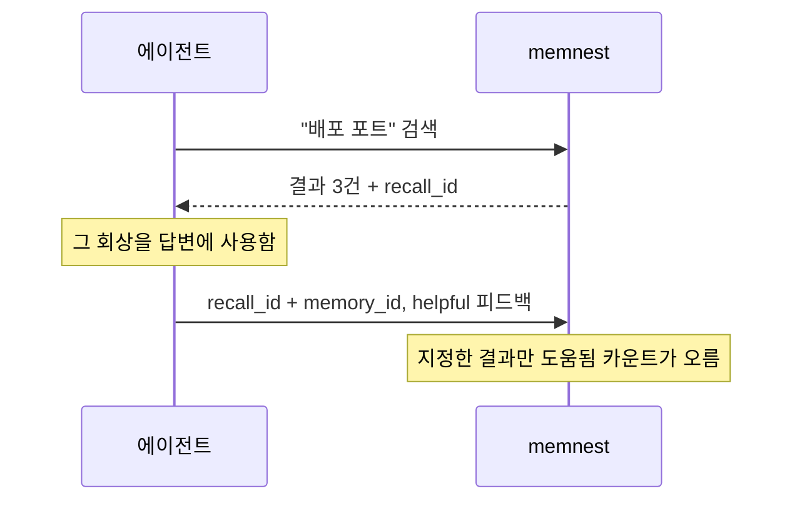
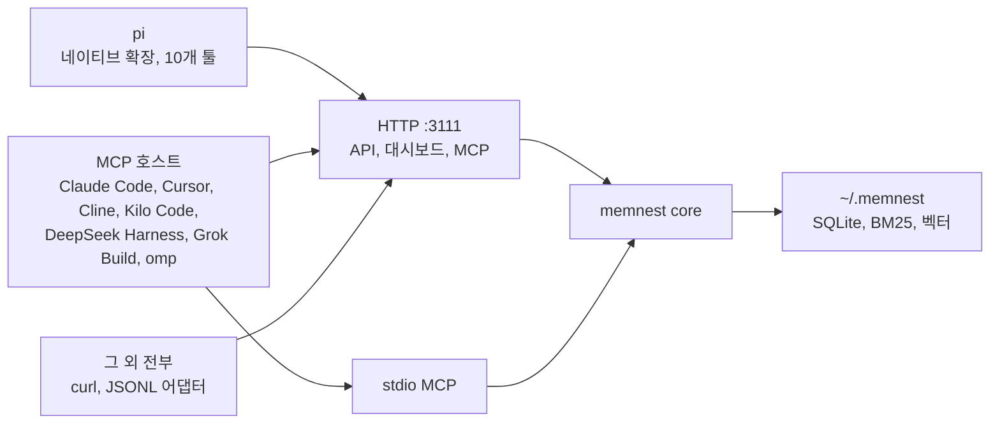
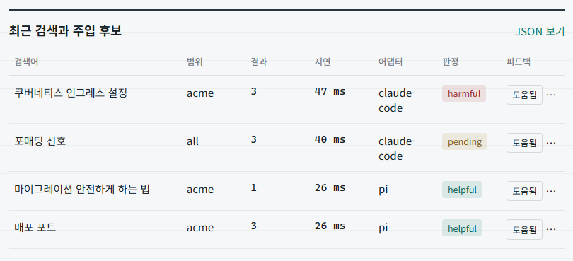
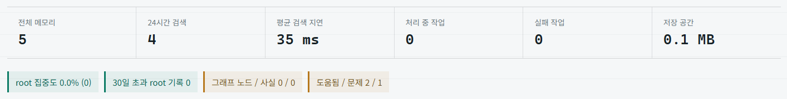

# memnest

<!-- markdownlint-disable MD013 -->

[English README](README.md)

**AI 코딩 에이전트를 위한 로컬 메모리.** 에이전트가 알게 된 것을 저장하고, 필요할 때 꺼내주고, 그 회상이 실제로 도움이 됐는지까지 보여준다. Rust로 짜인 실행 파일 하나가 전부다.

[](./LICENSE)


## 왜 필요한가

세션이 끝나면 프로젝트 결정도, 내 선호도, 내가 고쳐준 것도 같이 사라진다. 다음 세션에서 같은 제약을 처음부터 다시 설명하게 된다.

호스팅 메모리 서비스는 내 프로젝트 기록을 남의 서버에 올려둔다. 벡터 데이터베이스는 임베딩은 저장해도 어떤 기억이 실제로 쓰였는지, 검색이 왜 빗나갔는지는 알려주지 않는다. memnest는 저장소를 내 컴퓨터의 디렉터리에 두고, HTTP와 MCP로 서비스하고, 모든 회상을 기록해서 검색 품질을 짐작이 아니라 확인의 대상으로 만든다.

## 실행

```bash
git clone https://github.com/Blue-B/memnest.git
cd memnest/core && cargo build --release
./target/release/memnest --data-dir ~/.memnest
```

서비스와 대시보드 주소는 **`http://127.0.0.1:3111`** 이다.

이 문서는 이후로 바이너리를 이름으로 부른다. `PATH`에 올려두면 된다.

```bash
install -m755 target/release/memnest ~/.local/bin/memnest
```

그러면 `memnest status`로 상태와 대시보드 링크, 데이터 디렉터리를 볼 수 있다.

아직 npm이나 crates.io에 배포하지 않아서 설치는 전부 체크아웃 기준이다. 새로 설치하면 `~/.memnest`를 쓰고, 기존에 `~/.factory/memories`가 있으면 옮기기 전까지 그대로 쓴다. 빌드 결과물은 실행 파일 하나(리눅스 x86_64 기준 35MB, ONNX 런타임까지 정적 링크)라 사이드카 데몬이나 별도 런타임이 필요 없다. 대신 첫 실행 때 임베딩 모델 intfloat/multilingual-e5-base를 `~/.memnest/models`로 내려받고, 그게 1.1GB다.

## 저장하고, 검색하고, 평가하기

```bash
curl -s http://127.0.0.1:3111/add \
  -H 'content-type: application/json' \
  -d '{"text":"배포는 8320 포트를 쓴다","project":"acme","metadata":{"importance":"knowledge"}}'

curl -s http://127.0.0.1:3111/search \
  -H 'content-type: application/json' \
  -d '{"query":"배포 포트","project":"acme","n_results":3}'

curl -s http://127.0.0.1:3111/feedback \
  -H 'content-type: application/json' \
  -d '{"recall_id":"recall_...","memory_id":"manual_...","outcome":"helpful"}'
```

검색은 항상 `recall_id`를 돌려준다. `memory_id`를 지정한 피드백은 그 결과 하나의 랭킹만 바꾸고, 생략하면 랭킹을 바꾸지 않고 검색 전체 텔레메트리만 기록한다.



판정을 남기는 주체는 셋이다. 대시보드의 도움됨과 문제 버튼(사람), `memory_feedback` 툴에서 `memory_id`를 지정한 에이전트, `POST /feedback`(스크립트). 반영 강도는 랭킹 점수 기준 최대 ±0.10이라, 관련도를 뒤집는 게 아니라 비슷한 후보들 사이의 순위를 가른다.

첫 저장은 fastembed가 임베딩 모델을 내려받느라 느리다. `/add`는 레코드가 실제로 저장되고 색인된 뒤에야 `succeeded` 또는 `deduplicated`를 반환한다.

## 에이전트 연결

들어오는 길은 세 가지다. 쓰는 호스트가 지원하는 방식을 고르면 된다.



메모리 툴 6개와 금고 사용 시 제공되는 시크릿 툴 4개는 어느 호스트에서든 같은 공개 계약으로 동작한다. MCP는 모델이 스스로 부르는 툴 호출만 규정하고 호스트 세션 이벤트 훅은 주지 않기 때문에, 자동 주입과 자동 기록은 확장 대신 서브커맨드 두 개가 맡는다. `memnest hook`과 `memnest watch`이고 아래 [자동 메모리](#자동-메모리)에서 설명한다. pi 확장은 같은 동작에 `/memnest` 커맨드를 더한 것이다.

### pi, 네이티브 확장

```bash
cd memnest/pi-extension && npm install && pi install .
```

자동 컨텍스트는 기본값이 `balanced` 모드라 모든 프롬프트가 아니라 위험 신호가 보일 때만 짧은 메모리 카드를 넣는다. 지난 작업 회상, 자격증명, 뭐가 없거나 고장 난 상황, 비용, 설정 관련 표현이 거기에 해당한다. 트리거 패턴은 한국어와 영어를 모두 커버한다. 주제가 바뀔 때마다 넣으려면 `MEMNEST_AUTOCONTEXT_MODE=aggressive`를 켜면 된다. 주소는 `MEMNEST_URL`, 베어러 인증은 `MEMNEST_TOKEN`으로 설정한다. 자세한 내용은 [`pi-extension/README.md`](./pi-extension/README.md)에 있다.

### MCP 호스트

전송 방식은 둘이고, HTTP 쪽을 권장한다.

**Streamable HTTP(권장).** 띄워둔 서비스 하나가 API와 대시보드와 MCP를 같은 포트에서 받아준다. 여러 호스트가 프로세스 하나와 저장소 하나를 공유하고 대시보드도 그대로 쓴다.

```json
{
  "mcpServers": {
    "memnest": { "url": "http://127.0.0.1:3111/mcp" }
  }
}
```

`POST /mcp`은 `initialize`, `tools/list`, `tools/call`에 JSON 응답 하나로 답하고, 알림에는 202를, `GET`에는 405를 돌려준다.

**stdio.** 클라이언트가 memnest 프로세스를 자기 자식으로 띄우고 그 프로세스가 데이터 디렉터리를 직접 연다. 한 호스트만 그 저장소를 쓸 때만 권한다. 자식 프로세스와 대시보드용 서비스가 같이 떠 있으면 같은 파일에 쓰기 프로세스가 둘이 된다.

```json
{
  "mcpServers": {
    "memnest": {
      "command": "/absolute/path/to/memnest",
      "args": ["--mcp", "--data-dir", "/home/you/.memnest"]
    }
  }
}
```

각 벤더 문서에서 확인한 호스트는 Claude Code, Cursor, Cline, Kilo Code(`kilo.jsonc`의 `mcp` 키), DeepSeek Harness(`@deepseek-ai/dsh-mcp-client`), Grok Build(`grok mcp add`), 그리고 omp([oh-my-pi](https://github.com/can1357/oh-my-pi))다. omp는 확장 매니페스트가 `mcpServers` 필드를 받아서 등록되지만, 번들된 `@oh-my-pi/pi-mnemopi` 엔진이 이미 같은 역할을 한다. 설정 파일 위치는 호스트마다 다르다.

## 자동 메모리

검색은 에이전트가 검색하기로 마음먹어야 도움이 된다. 서브커맨드 두 개가 호스트별 확장 없이 그 간극을 메운다.

**`memnest hook`은 프롬프트 직전에 컨텍스트를 주입한다.** 호스트가 주는 훅 페이로드를 stdin으로 읽고, 돌고 있는 서비스에서 컨텍스트 팩을 받아, 그 호스트가 기대하는 모양으로 답한다. Claude Code라면 설정 세 줄이다.

```json
{ "hooks": { "UserPromptSubmit": [{ "hooks": [{ "type": "command", "command": "memnest hook" }] }] } }
```

출력 형식은 페이로드 모양을 보고 정하므로, command 훅이 stdout을 프롬프트에 붙이는 호스트라면 같은 명령이 그대로 통한다. 명시하고 싶으면 `--format`으로 고정한다. 프롬프트를 막는 일은 없다. 서비스가 죽었거나 느리면 아무것도 출력하지 않고 exit 0으로 끝나며 이유는 stderr로만 남긴다.

**`memnest watch`는 호스트 설정 없이 대화를 기록한다.** 호스트가 이미 남기고 있는 세션 트랜스크립트를 따라가며 대화를 저장한다. 현재 Claude Code와 pi 형식을 지원한다.

```bash
memnest watch                  # 알려진 트랜스크립트 디렉터리 감시
memnest watch --once           # 한 번만 훑기, cron에 걸기 좋다
memnest watch --backfill       # 새 대화만이 아니라 기존 기록도 가져오기
```

도구 호출과 결과, 추론 블록은 건너뛴다. 저장소에 기계 동작이 아니라 대화가 남게 하려는 것이다. 진행 위치는 `<data-dir>/watch-state.json`에 파일별 바이트 오프셋으로 기록되고, 그래서 재시작해도 같은 대화를 두 번 저장하지 않는다. 오프셋은 저장에 성공한 뒤에만 전진한다. 동작을 보려면 `RUST_LOG=info`를 붙인다.

### 그 외 전부

MCP는 선택이다. 위의 HTTP API가 계약의 전부라서 POST를 보낼 수 있으면 뭐든 저장하고 검색할 수 있다. MCP를 지원하지 않는 에디터, 셸 스크립트, CI 잡, 직접 만든 접착 코드까지 포함된다. [`adapters/`](./adapters)에 있는 JSONL 어댑터는 호스트 이벤트를 이 API로 옮기는 예제다. 어댑터는 호출마다 `adapter`와 `adapter_version`을 보내서 트래픽과 실패가 대시보드에 그대로 보인다.

## 대시보드

API와 같은 포트에서 열린다. 보통의 메모리 저장소가 답해주지 않는 것, 무엇이 저장됐고 무엇이 검색됐고 그 회상이 도움이 됐는지를 보여준다.



한 줄이 실제 검색 한 번이다. 검색어, 결과 수, 지연, 어떤 어댑터가 물었는지, 그리고 기록된 판정이 남는다.



전체 개수, 24시간 검색 수, 지연, 처리 중과 실패한 작업, 디스크 사용량. 실패한 저장이 로그 파일 속으로 사라지지 않고 여기에 뜬다.

## 구현된 기능

| 영역 | 내용 |
| --- | --- |
| 검색 | BM25와 HNSW 벡터 하이브리드, 프로젝트 필터, 모든 검색에 `recall_id` |
| 피드백 루프 | 도움됨과 문제 판정이 기억별로 남고 랭킹 점수에 반영된다. ±0.10으로 제한 |
| 구조화 메모리 | record, fact, rule, procedure 종류와 확신도, 출처, 검증 메타데이터 |
| 컨텍스트 조립 | 글자 수로 예산을 잡는 컨텍스트 팩. 유니코드 문자 기준이라 한글이 일찍 잘리지 않는다 |
| 관측 | 회상 이벤트와 처리 작업을 90일간 보관하고 지연, 어댑터, 결과를 남긴다 |
| 복구 | 삭제는 휴지통으로 가고 복원하면 다시 색인된다. 완전 삭제 전에 월별 JSONL로 보관한다 |
| 시크릿 보관 | 별도 금고가 자격증명 값을 로컬 마스터 키로 AES-256-GCM 암호화한다 |

memnest는 메모리 엔진이지 에이전트 런타임이 아니다. 에이전트를 실행하거나 프롬프트를 관리하거나 컨텍스트 압축을 대신하지 않는다.

리눅스, WSL, 윈도우 서비스 설치와 백업, 보존 정책, CLI 레퍼런스는 [운영 가이드](docs/operations.md)에 있다. 영어로 작성돼 있다.

## 저장소 구성

| 디렉터리 | 패키지 | 역할 |
| --- | --- | --- |
| [`core/`](./core) | `memnest` 0.2.0 | **필수.** HTTP API, MCP 서버, 색인, 수명주기, 금고, 대시보드 |
| [`pi-extension/`](./pi-extension) | `pi-memnest` 0.6.0 | pi 연동. 툴 10개, `/memnest`, 프로젝트 범위 자동 컨텍스트, 피드백 |
| [`adapters/`](./adapters) | 계약 | 연동 계약과 참조용 JSONL 어댑터 |
| [`journal/`](./journal) | `memnest-journal` 0.1.0 | 선택. 마크다운과 git 감사 미러, 데이터베이스 백업은 아니다 |

## 보안

HTTP 서버는 `127.0.0.1`에 바인딩한다. 외부 바인딩은 `MEMNEST_TOKEN`이 설정돼 있을 때만 허용되고, 그때는 요청에 `Authorization: Bearer <token>`이 필요하다. 3111 포트를 인터넷에 그대로 열지 말 것.

메모리 텍스트는 로컬에 저장되지만 **저장 시 암호화되지 않는다.** 들어오는 텍스트에서 자격증명처럼 생긴 문자열을 찾아 가리긴 하지만 그건 안전망이지 비밀을 넣어도 되는 자리가 아니다. 비밀은 금고를 쓴다. memnest는 시작할 때 `<data-dir>/master.key`를 만들고 그 키로 AES-256-GCM 암호화를 한다. 키가 없으면 암호화 헬퍼가 평문 저장으로 넘어가므로, 금고를 믿기 전에 그 파일이 있는지 확인할 것.

엔진 의존성 고지는 [`core/THIRD_PARTY_NOTICES.md`](./core/THIRD_PARTY_NOTICES.md)에 있다.

## 기여

건드린 컴포넌트에 해당하는 검사를 [운영 가이드](docs/operations.md#development-checks) 대로 돌린다. 이슈와 풀 리퀘스트는 [memnest 저장소](https://github.com/Blue-B/memnest/issues)로 보내면 된다.

## 라이선스

MIT © Blue-B
