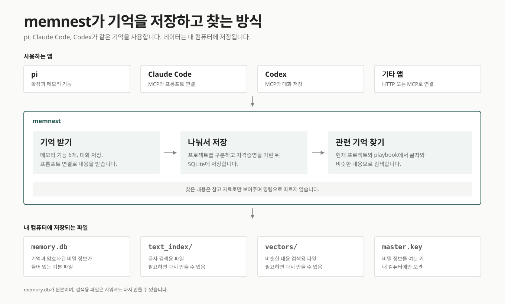

# memnest

<!-- markdownlint-disable MD013 -->

[English README](README.md)

AI 코딩 에이전트는 세션이 끝나면 전부 잊습니다. memnest는 그 기억을 내 컴퓨터에 남겨 다음 세션에 돌려주고, pi와 Claude Code, Codex, 다른 MCP 클라이언트가 모두 같은 툴 계약으로 꺼내 쓰게 합니다.

[](./LICENSE)




## 무엇을 해주나

| 기능 | 설명 |
| --- | --- |
| 기억 보관 | 결정, 선호, 교정처럼 의도해서 남긴 내용을 저장합니다. 대화 로그를 통째로 붓지 않습니다. |
| 대화 기록 | 사용자와 어시스턴트의 발언을 자격증명만 가린 원문 그대로, LLM 요약 없이 검색 가능하게 둡니다. |
| 하이브리드 검색 | 두 종류 모두를 로컬 BM25 단어 검색과 HNSW 벡터 유사도로 함께 찾습니다. |
| 프로젝트 분리 | 폴더 하나의 기억은 그 workspace 안에 머물고, `playbook`이 전역 공유 규칙을 맡습니다. |
| 회상 피드백 | 나온 결과에 도움됨이나 해로움을 표시하면 다음 순위가 그 신호를 따릅니다. |
| 비밀 금고 | 자격증명은 AES-256-GCM 저장소에 두어 검색 대상과 분리합니다. |

도구 호출과 프롬프트 시점 회상, 대화 캡처는 하나의 Rust 서비스가 서로 다른 데이터 경로로 처리합니다. 원본은 SQLite이고 옆에 있는 Tantivy, HNSW 색인은 지워도 다시 만들 수 있습니다. 어느 단계에서도 LLM을 호출하지 않으며 임베딩은 `intfloat/multilingual-e5-base`로 로컬에서 돌아갑니다.

## 설치

```bash
git clone https://github.com/Blue-B/memnest.git
cd memnest/core
cargo build --release
install -m755 target/release/memnest ~/.local/bin/memnest
memnest --data-dir ~/.memnest
```

대시보드와 HTTP API, Streamable HTTP MCP 엔드포인트가 주소 하나를 공유합니다.

```text
http://127.0.0.1:3111        대시보드와 HTTP API
http://127.0.0.1:3111/mcp    MCP 엔드포인트
```

서비스를 켜는 것만으로는 아무것도 내려받지 않습니다. 임베딩 모델은 실제로 필요한 첫 요청, 그러니까 처음 저장하거나 처음 검색할 때 내려받아서 그 요청만 유독 오래 걸립니다. `memnest --warmup-embedding`으로 미리 받아 둘 수 있습니다.

Linux, WSL, Windows 서비스 설정과 백업, 복구, 보존 정책은 [`docs/operations.md`](docs/operations.md)에 있습니다.

## 에이전트 연결

### MCP

실행 중인 서비스 주소를 MCP 클라이언트에 등록합니다.

```json
{
  "mcpServers": {
    "memnest": { "url": "http://127.0.0.1:3111/mcp" }
  }
}
```

여러 클라이언트가 서버와 데이터 디렉터리 하나를 공유할 수 있는 Streamable HTTP 방식을 권장합니다. stdio는 그 프로세스가 저장소를 단독으로 쓸 때만 사용합니다. 같은 데이터 디렉터리를 열려는 두 번째 writer는 색인을 덮어쓰지 못하도록 바로 거부됩니다.

```json
{
  "mcpServers": {
    "memnest": {
      "command": "/absolute/path/to/memnest",
      "args": ["--mcp", "--data-dir", "/home/you/.memnest"]
    }
  }
}
```

### pi

```bash
cd memnest/pi-extension
npm install
pi install .
```

pi 확장은 메모리 툴 6개와 workspace 범위 Autocontext, 상태 확인용 `/memnest`를 추가합니다. 금고 툴은 선택해서 켭니다. 자세한 내용은 [`pi-extension/README.md`](pi-extension/README.md)에 있습니다.

### HTTP와 직접 연동

MCP 없이 HTTP API만 사용할 수도 있습니다. [`adapters/generic-http`](adapters/generic-http)에 의존성 없는 JSONL 참조 어댑터가 있습니다.

## 툴 계약

모든 호스트에서 메모리 툴 6개를 사용합니다.

```text
memory_remember
memory_search
memory_get
memory_update
memory_delete
memory_feedback
```

로컬 금고 API는 초기화되지만 모델용 시크릿 툴은 기본적으로 숨깁니다. 신뢰하는 에이전트 프로세스에서 `MEMNEST_EXPOSE_SECRET_TOOLS=1`을 설정하면 다음 4개가 추가됩니다.

```text
secret_set
secret_get
secret_list
secret_delete
```

검색은 workspace 범위로 동작합니다. 클라이언트는 절대 경로인 `cwd`, 명시적인 `project`, 또는 의도적인 전체 검색인 `project=all`을 보냅니다. 모든 검색은 `recall_id`를 반환합니다. `recall_id`와 `memory_id`를 함께 보낸 피드백은 그 검색 결과 하나에만 반영됩니다. 삭제한 기억은 바로 지우지 않고 휴지통으로 이동합니다.

### workspace를 식별하는 방식

자동으로 만든 workspace ID는 정규화한 작업 디렉터리 절대 경로의 안정적인 해시라서 경로 원문이 공개 collection 이름으로 드러나지 않습니다. `/work/client-a/api`와 `/personal/api`는 서로 다른 workspace이며, 자동 검색은 현재 workspace와 `playbook`만 읽습니다.

폴더 이름을 따른 기존 collection은 그 이름을 쓰는 등록 workspace가 하나일 때만 호환 별칭으로 읽습니다. 두 번째 `api` workspace가 나타나는 순간, 기존 행의 소유자를 추측하는 대신 두 쪽 모두에서 모호한 별칭을 끕니다. 이름을 직접 관리하는 기존 collection을 쓸 때는 `project`를 명시하면 됩니다.

### 기억을 교체할 때

`supersedes=<id>`로 저장한 기억은 같은 범위의 활성 기억만 교체할 수 있습니다. 새 기억 저장과 기존 행의 `_superseded` 이동은 SQLite 트랜잭션 하나에서 처리합니다.

구조화한 fact, rule, 출처, 교정은 메타데이터가 사라지지 않도록 semantic content dedup 대상에서 제외합니다. `confidence`와 `verified_at`은 클라이언트가 보낸 주장으로 남으며 검색 순위를 자동으로 높이지 않습니다.

## 자동 컨텍스트와 대화 저장

`memnest hook`은 호스트의 프롬프트 이벤트를 stdin으로 읽고, 현재 workspace와 관련된 짧은 컨텍스트를 출력합니다. 작업 디렉터리를 알 수 없거나 서비스가 꺼져 있으면 아무것도 출력하지 않고 프롬프트를 막지 않습니다. 검색 텍스트는 신뢰하지 않는 참고자료로 표시합니다. transcript 결과는 과거 대화 증거로 따로 표시하고, 주입 전에 포함된 markup을 escape합니다.

Claude Code 설정 예시입니다.

```json
{
  "hooks": {
    "UserPromptSubmit": [
      {
        "hooks": [
          { "type": "command", "command": "memnest hook" }
        ]
      }
    ]
  }
}
```

`memnest watch`는 pi, Claude Code, Codex 대화를 저장하는 단일 경로입니다.

```bash
memnest watch
memnest watch --once
memnest watch --backfill
```

자격증명을 가린 뒤 사용자와 어시스턴트에게 보이는 텍스트만 저장합니다. system 및 developer 프롬프트, reasoning, reminder, 툴 호출과 결과, 이미지, 서브에이전트 내부 대화는 제외합니다. 긴 대화는 순서가 있는 검색 청크로 나눕니다. 같은 말을 여러 번 했으면 각각 저장하고, 같은 transcript 이벤트의 재시도만 중복으로 처리합니다.

watcher는 알려진 transcript 디렉터리를 감시하고 `<data-dir>/watch-state.json`에 파일별 위치를 기록합니다. 모든 청크가 저장되거나 복구된 뒤에만 위치가 전진합니다. 기본값은 새 대화부터 읽으며, 기존 기록을 가져오려면 `--backfill`을 사용합니다.

## 저장 구조와 대시보드

기본 데이터 디렉터리는 `~/.memnest`입니다.

```text
memory.db       SQLite 레코드, workspace 등록 정보, 대기 중인 색인 작업
text_index/     다시 만들 수 있는 Tantivy BM25 색인
vectors/        다시 만들 수 있는 HNSW 벡터 색인
models/         로컬 임베딩 모델
master.key      금고 키
archive/        완전 삭제된 기억의 평문 JSONL
watch-state.json
```

`http://127.0.0.1:3111` 대시보드에서 저장된 기억, 검색 기록, 지연, 처리 실패, 회상 피드백을 한 화면에서 확인할 수 있습니다.


## 보안

서버는 기본적으로 `127.0.0.1`에 바인딩합니다. `MEMNEST_TOKEN`이 비어 있으면 외부 주소 바인딩을 거부합니다. 토큰을 설정한 경우 클라이언트는 `Authorization: Bearer <token>`을 보내야 합니다.

일반 메모리 텍스트는 로컬에 저장되지만 저장 시 암호화되지는 않습니다. 자격증명처럼 보이는 문자열을 저장 전에 가리고, 기존 `raw_chunk` 필드는 공개 메모리 작업으로 쓸 수 없습니다. 비밀값은 검색 메모리가 아니라 금고에 넣어야 합니다. 새 저장소는 비공개 권한으로 `<data-dir>/master.key`를 만들고 AES-256-GCM을 사용합니다. 새 암호문은 secret key 또는 server 이름에 묶이며 기존 `$enc$` 행도 계속 읽을 수 있습니다. 저장된 암호문이 현재 키와 맞지 않으면 시작 단계에서 실패합니다. `master.key`는 별도로 백업해 두세요.

삭제는 완전 삭제가 아닙니다. 지운 기억은 30일 동안 휴지통에 남고, 휴지통에서 최종 삭제될 때 레코드 전체가 `<data-dir>/archive/YYYY-MM.jsonl`에 평문으로 기록됩니다. `MEMNEST_ARCHIVE=0`으로 이 파일 기록을 끌 수 있고, 이미 쌓인 `archive/` 디렉터리는 직접 지워야 합니다.

3111 포트를 인터넷에 직접 공개하지 마세요. 나머지 보안 내용은 [`SECURITY.md`](SECURITY.md)에 있습니다.

## 저장소 구성

| 디렉터리 | 역할 |
| --- | --- |
| [`core/`](core) | Rust 서버, CLI, 색인, MCP, 금고, watcher, 대시보드 |
| [`pi-extension/`](pi-extension) | 얇은 pi 어댑터와 workspace 범위 Autocontext |
| [`adapters/`](adapters) | 연동 계약과 일반 HTTP 어댑터 |
| [`journal/`](journal) | 선택 기능인 Markdown 및 git 감사 미러, 데이터베이스 백업은 아님 |

개발 검사 명령입니다.

```bash
(cd core && cargo test --locked -- --test-threads=1)
(cd pi-extension && npm install && npm run build && npm run smoke)
(cd adapters/generic-http && node test.mjs)
```

엔진 의존성 고지는 [`core/THIRD_PARTY_NOTICES.md`](core/THIRD_PARTY_NOTICES.md)에 있습니다. 기여 방법은 [`CONTRIBUTING.md`](CONTRIBUTING.md)를 따릅니다.

## 라이선스

MIT © Blue-B
