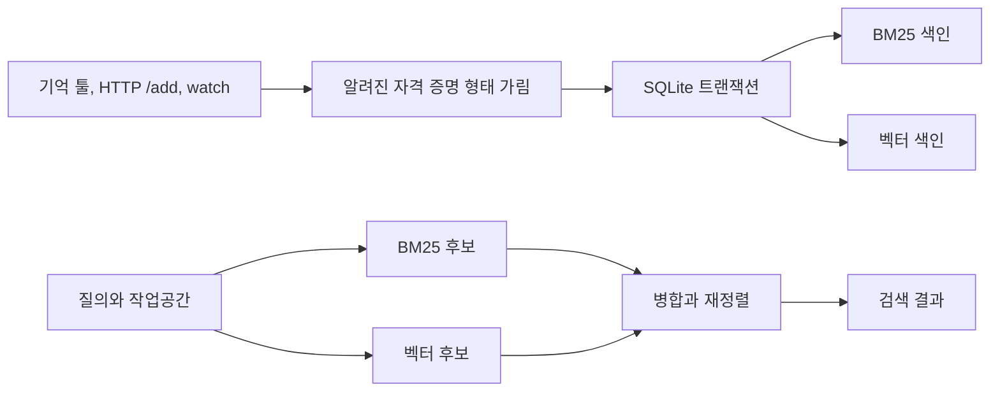

# memnest

<!-- markdownlint-disable MD013 -->

[English README](README.md)

코딩 에이전트는 세션이 끝나면 이전 작업을 잊습니다. Memnest는 선택해서 저장한 기억과 대화 기록을 내 컴퓨터에 보관하고, 다음 pi, Claude Code, Codex, MCP 세션에서 다시 찾게 해줍니다.

[](https://github.com/Blue-B/memnest/releases/latest)
[](./LICENSE)


[](https://www.npmjs.com/package/pi-memnest)


## 주요 기능

| 기능 | 동작 |
| --- | --- |
| 영구 기억 | 결정, 선호, 정정, 사실, 규칙을 세션이 끝난 뒤에도 보관합니다. |
| 대화 저장 | 사용자와 어시스턴트가 주고받은 텍스트를 자격 증명 형태만 가린 뒤 요약 없이 저장합니다. |
| 로컬 검색 | BM25 키워드 검색과 다국어 벡터 유사도를 함께 사용합니다. |
| 작업공간 분리 | 디렉터리별 기억을 나누고, `playbook`에는 모든 프로젝트에서 공유할 규칙을 둡니다. |
| 비밀 금고 | 자격 증명을 검색 가능한 기억과 분리해 AES-256-GCM으로 암호화합니다. |

항상 불러와야 하는 짧은 규칙은 `CLAUDE.md`나 `AGENTS.md`에 적는 편이 가장 단순합니다. Memnest는 프로젝트와 세션이 늘면서 쌓이고, 지금 질문과 관련 있을 때만 찾아야 하는 자료에 적합합니다.

Rust 서비스 하나가 모든 기능을 처리합니다. SQLite가 원본이고 검색 색인은 다시 만들 수 있습니다. 임베딩은 로컬에서 실행하며 LLM은 호출하지 않습니다.

## 빠른 시작

Linux x86_64와 aarch64에서는 Rust 툴체인 없이 최신 릴리스를 설치할 수 있습니다.

```bash
curl -fsSL https://raw.githubusercontent.com/Blue-B/memnest/main/core/scripts/install.sh \
  -o /tmp/memnest-install.sh
# 실행하기 전에 스크립트를 확인하세요.
bash /tmp/memnest-install.sh --user
curl -fsS http://127.0.0.1:3111/health
```

Windows, WSL, 소스 빌드, 삭제, 백업, 복구, 설정은 [운영 문서](docs/operations.md)에 있습니다.

처음 저장하거나 검색할 때 로컬 임베딩 모델을 내려받습니다. 기본 모델은 디스크 약 1.1 GB를 쓰고 임베딩 중에는 메모리를 약 1.9 GB까지 사용할 수 있습니다.

### pi

코어 서비스를 먼저 실행한 뒤 어댑터를 설치합니다.

```bash
pi install npm:pi-memnest
```

어댑터는 기억 툴과 작업공간 범위 Autocontext를 등록하고 `/memnest` 상태 명령을 제공합니다. 자세한 내용은 [pi 확장 문서](pi-extension/README.md)에 있습니다.

### MCP

Streamable HTTP MCP 클라이언트를 실행 중인 서비스에 연결합니다.

```json
{
  "mcpServers": {
    "memnest": { "url": "http://127.0.0.1:3111/mcp" }
  }
}
```

같은 서비스가 `http://127.0.0.1:3111`에서 JSON HTTP API도 제공합니다. stdio MCP와 다른 호스트 연결 예시는 [어댑터 문서](adapters/README.md)에 있습니다.

## 사용법

모든 호스트에서 같은 기억 툴 5개를 사용합니다.

```text
memory_remember
memory_search
memory_get
memory_update
memory_delete
```

에이전트가 공유 규칙을 저장하고 다음 세션에서 찾는 예시입니다.

```text
memory_remember(text="staging에서는 5433 포트를 사용한다.", project="playbook")
memory_search(query="staging 데이터베이스 포트", project="playbook")
```

호스트가 현재 작업 디렉터리를 전달한다면 `project`를 생략할 수 있습니다. 현재 작업공간과 `playbook`을 함께 검색합니다. 모든 프로젝트를 검색하려는 경우에만 `project=all`을 사용하세요. 삭제한 기억은 바로 지워지지 않고 휴지통으로 이동합니다.

비밀 금고 툴은 기본적으로 모델에 노출되지 않습니다. 신뢰하는 프로세스에서만 `MEMNEST_EXPOSE_SECRET_TOOLS=1`로 켤 수 있습니다.

## 자동 회상과 대화 저장

`memnest hook`은 Claude Code와 Codex가 프롬프트를 보내기 전에 관련 컨텍스트를 붙입니다. 서비스나 작업공간을 찾지 못하면 아무것도 출력하지 않으므로 프롬프트를 막지 않습니다.

```json
{
  "hooks": {
    "UserPromptSubmit": [
      { "hooks": [{ "type": "command", "command": "memnest hook" }] }
    ]
  }
}
```

`memnest watch`는 pi, Claude Code, Codex 대화를 따라가며 화면에 보이는 대화 텍스트를 저장합니다.

```bash
memnest watch
memnest watch --backfill
```

시스템 프롬프트, 개발자 프롬프트, reasoning, 툴 입출력, 이미지, 서브에이전트 대화는 저장하지 않습니다. 저장한 대화는 직접 삭제하기 전까지 보관됩니다. 보존과 복구 규칙은 [운영 문서](docs/operations.md)에 있습니다.

## 검색과 저장 구조



모든 쓰기는 파생 색인보다 먼저 SQLite에 반영됩니다. 중단된 색인 작업은 시작할 때 다시 실행되며, 색인이 없어져도 `memory.db`에서 다시 만들 수 있습니다.

검색 결과를 사용할 때 알아둘 동작은 두 가지입니다.

- Memnest는 코드를 읽지 않으므로 저장한 사실이 낡았는지 자동으로 알 수 없습니다. 사실이 바뀌면 `supersedes=<id>`로 새 기억을 저장해야 합니다.
- 검색은 가장 가까운 기억을 정렬합니다. 저장소에 실제 답이 있는지는 증명하지 못하므로 결과를 확인한 뒤 사용해야 합니다.

## 데이터와 보안

서버는 기본적으로 `127.0.0.1`에만 바인딩합니다. 3111 포트를 인터넷에 직접 노출하지 마세요.

일반 기억은 로컬에 저장되지만 암호화되지 않습니다. redaction은 알려진 자격 증명 형태만 잡으므로 비밀 값은 검색 가능한 기억이 아니라 금고에 저장해야 합니다. 삭제한 기록은 30일 동안 휴지통에서 복구할 수 있고 archive JSONL에도 남을 수 있습니다. 민감한 자료를 저장하기 전에 [SECURITY.md](SECURITY.md)를 읽으세요.

`memory.db`와 `master.key`를 함께 백업하세요. 데이터베이스는 다시 만들 수 없지만 텍스트 색인과 벡터 색인은 다시 만들 수 있습니다.

## 문서

- [운영](docs/operations.md): 설치, 설정, 보존, 백업, 복구, CLI
- [보안](SECURITY.md): 위협 모델, 금고, redaction, 삭제, 네트워크 바인딩
- [설계 결정](docs/design-decisions.md): 현재 아키텍처를 선택한 이유
- [pi 확장](pi-extension/README.md): pi 설치와 Autocontext 동작
- [어댑터](adapters/README.md): MCP, HTTP, 다른 호스트 연결
- [기여](CONTRIBUTING.md): 개발 환경과 검사 명령

Memnest는 `0.1.x` 단계입니다. 업그레이드 전에 데이터베이스를 백업하고 [릴리스 노트](https://github.com/Blue-B/memnest/releases)에서 호환성 변경을 확인하세요.

## 라이선스

MIT © Blue-B
