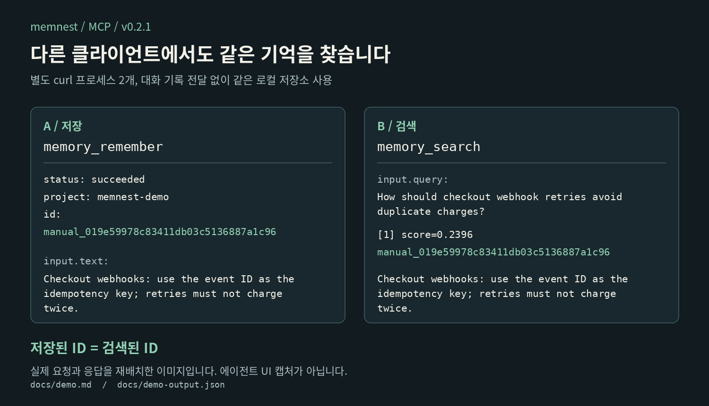

# memnest

<!-- markdownlint-disable MD013 MD033 -->


[English](README.md) | [설치](#설치) | [사용법](#사용법) | [운영 문서](docs/operations.md)

지난주 Claude Code가 설정을 바꾼 이유를 오늘 Codex에서 찾습니다. Memnest는 AI가 다시 작성한 요약 대신 내 컴퓨터에 수집된 당시 기록을 검색하게 해줍니다.

pi, Claude Code, Codex의 보이는 대화 텍스트를 로컬에 저장하고, 하나의 저장소를 MCP와 HTTP로 함께 제공합니다. Memnest 자체는 생성형 LLM을 호출하지 않으며 클라우드 계정도 필요하지 않습니다.

[](https://github.com/Blue-B/memnest/releases/latest)
[](https://www.npmjs.com/package/pi-memnest)
[](LICENSE)

[](docs/demo.md)

저장소에 포함된 [재현 데모](docs/demo.md)는 서로 상태를 공유하지 않는 두 클라이언트 프로세스에서 실제 요청을 보내고, 저장 ID와 검색한 원문이 같은지 검사합니다. LLM이 스스로 도구를 골랐다고 과장하지 않고 공유 저장소와 대화 파서가 동작한다는 범위만 입증합니다. [실제 클라이언트 검증](docs/client-validation.md)에는 별도로 확인한 pi 경로와 Claude Code, Codex의 계정 차단을 구분해 기록했습니다.

## Memnest를 쓰는 이유

- **원문 근거를 확인할 수 있습니다.** 검색 결과에는 안정적인 기록 ID가 있습니다. 현재 소스 빌드에서는 긴 기록을 이어 읽고 가능한 세션과 수집 출처 정보도 확인할 수 있습니다.
- **여러 클라이언트가 같은 기록을 봅니다.** pi, Claude Code, Codex와 다른 MCP 클라이언트가 따로 기억 사본을 관리하지 않고 하나의 로컬 서비스를 조회합니다.
- **기억을 생성형 AI로 다시 쓰지 않습니다.** 대화 저장 과정에서 LLM 요약을 만들지 않습니다. 검색에는 로컬 키워드 색인과 다국어 임베딩을 사용합니다.
- **공개 도구가 다섯 개뿐입니다.** 저장, 검색, 조회, 정정, 삭제에 집중합니다. 삭제한 기록은 휴지통으로 이동하고, 바뀐 사실은 이전 기록을 남긴 채 대체할 수 있습니다.

매번 읽어야 하는 짧은 규칙이라면 `CLAUDE.md`나 `AGENTS.md`가 더 간단합니다. Memnest는 계속 쌓이는 기록을 필요할 때 찾아보려는 경우에 적합합니다. ChatGPT나 Claude의 내장 메모리를 가져오거나 동기화하는 도구는 아닙니다.

## 설치

### Linux 배포판

Rust 없이 코어 v0.3.0을 설치합니다. 내려받은 스크립트를 읽은 뒤 실행하세요. setup은 서버와 대화 감시기를 설치하고 시작하며, Claude Code, Codex, Cursor의 빠진 연결을 추가한 뒤 임시 기억의 저장과 검색을 확인합니다.

```bash
curl -fsSL https://raw.githubusercontent.com/Blue-B/memnest/v0.3.0/core/scripts/install.sh \
  -o /tmp/memnest-install.sh
VERSION=v0.3.0 bash /tmp/memnest-install.sh --user
```

클라이언트 파일과 지원되는 서비스 변경은 수정 전에 백업하고, setup이 정확한 복구 명령을 출력합니다. 기존 Memnest 연결, 직접 바꾼 서비스 실행 명령, systemd 추가 설정과 외부 환경 파일은 추측해 덮어쓰지 않습니다. 자동 회상 hook은 `--autocontext`를 추가한 경우에만 설정합니다.

처음 저장하거나 검색할 때 약 1.1 GB의 임베딩 모델을 내려받습니다. 임베딩 중에는 RAM을 약 1.9 GB까지 사용할 수 있습니다. 업그레이드 전에는 `memory.db`와 `master.key`를 백업하세요. Windows, WSL, 업그레이드와 복구 방법은 [운영 문서](docs/operations.md)에 있습니다.

### 소스에서 빌드

Rust와 Python 3.11 이상이 필요합니다.

```bash
cargo build --release --locked --manifest-path core/Cargo.toml
bash core/scripts/setup.sh --user --bin core/target/release/memnest
```

pi는 별도로 설치합니다. 기존 Linux 서비스의 업그레이드와 복구는 [운영 문서](docs/operations.md#linux-service-upgrades)를 참고하세요.

## 클라이언트 연결

### pi

```bash
pi install npm:pi-memnest@0.3.0
```

저장소 소스를 직접 쓰려면 루트에서 로컬 확장을 빌드하고 설치합니다.

```bash
(cd pi-extension && npm ci && npm run build)
pi install ./pi-extension
```

확장은 기억 도구 5개와 `/memnest` 상태 명령을 제공합니다. v0.3.0의 자동 회상은 기본으로 꺼져 있습니다. 켜려면 `MEMNEST_AUTOCONTEXT_MODE=balanced`를 설정하세요. 자세한 설정은 [pi 확장 문서](pi-extension/README.md)에 있습니다.

### MCP

Streamable HTTP MCP 클라이언트를 실행 중인 서비스에 연결합니다.

```json
{
  "mcpServers": {
    "memnest": { "url": "http://127.0.0.1:3111/mcp" }
  }
}
```

stdio MCP와 JSON HTTP 예시는 [어댑터 문서](adapters/README.md)에 있습니다. 기록을 공유하려는 클라이언트는 같은 서비스에 연결해야 합니다.

## 사용법

모든 클라이언트에서 같은 기억 도구 5개를 사용합니다. `memory_remember`, `memory_search`, `memory_get`, `memory_update`, `memory_delete`입니다.

```text
memory_remember(text="staging에서는 5433 포트를 사용한다.", project="playbook")
memory_search(query="staging 데이터베이스 포트", project="playbook")
memory_get(id="<검색 결과의 ID>")
```

호스트가 현재 디렉터리를 전달한다면 `project`를 생략해 현재 작업공간과 `playbook`을 함께 검색할 수 있습니다. 전체 프로젝트를 검색하려는 경우에만 `project=all`을 사용하세요. 사실이 바뀌면 `supersedes=<이전 ID>`로 새 기억을 저장합니다. 삭제한 기록은 휴지통으로 이동합니다.

### 원문 더 읽기

검색은 기존처럼 결과마다 최대 600자를 보여줍니다. 시험적으로 추가했던 검색 전체 글자 수 제한은 제거했습니다.

```text
memory_get(id="<검색 결과 ID>", offset=0, max_chars=8000)
memory_get(id="<같은 ID>", offset=<next_offset>, max_chars=8000)
memory_get(id="<대화 기록 ID>", before=1, after=1)
```

이전에는 조회해도 앞 8,000자까지만 볼 수 있었지만, 이제 뒷부분을 이어 읽을 수 있습니다. 주변 기록은 다른 프로젝트가 아니라 같은 대화에서 가져옵니다. 저장된 순서가 실제 대화 순서와 항상 같지는 않습니다. 원문이 잘렸다면 `next_offset`부터 다시 읽고, 주변 기록은 해당 ID로 따로 조회할 수 있습니다. 자세한 동작은 [원문 조회 문서](docs/bounded-retrieval.md)에 있습니다.

### 대화 저장

```bash
memnest watch
memnest watch --backfill
```

대화 저장과 자동 회상은 별개입니다. 시스템과 개발자 프롬프트, 추론 내용, 도구 입출력, 이미지, 서브에이전트 대화는 저장하지 않습니다. 수집한 대화는 삭제할 때까지 보관합니다. 자동 회상은 선택 기능이며, 관련 없는 기억을 고를 수도 있으므로 원문을 확인한 뒤 사용하세요.

## 호환성과 배포 상태

v0.3.0은 Linux x86_64와 Arm64 코어 압축 파일, npm의 `pi-memnest` 0.3.0을 제공합니다. 통합 setup, 긴 원문 이어 읽기, 같은 대화의 주변 기록, 제한된 출처 정보, 더 명확한 정정 오류와 pi 자동 회상 기본 꺼짐이 포함됩니다.

이번 범위는 안전한 설치와 원문 근거 조회에 집중합니다. 그래프, 관리 화면, 팀 서비스나 검색 결과가 질문에 완전히 답하는지 판정하는 모델은 포함하지 않습니다.

macOS 설치와 패키징 코드는 있지만 실제 설치, 재시작과 제거를 검증하지 못했습니다. 아직 검증된 배포 대상으로 보지 마세요.

자세한 변경점은 [v0.3.0 요약](docs/next-release.ko.md), [코어 변경 이력](core/CHANGELOG.md), [pi 변경 이력](pi-extension/CHANGELOG.md)에 있습니다.

## 동작 구조


Rust 서비스 하나가 SQLite에 기록을 저장하고, BM25와 로컬 다국어 임베딩으로 검색합니다. SQLite가 원본이고 검색 색인은 다시 만들 수 있습니다. v0.3.0은 임베딩 모델을 유지하면서 후보 결합 오류를 보수적으로 고쳤으며, 새 학습 순위 모델은 추가하지 않았습니다.

Memnest 자체는 생성형 LLM을 호출하지 않습니다. 연결한 코딩 AI가 검색 결과를 읽고 판단할 때는 그 AI의 모델을 사용합니다. Memnest는 저장소에 답이 있는지 증명하거나, 코드 변경으로 옛 기억이 틀렸는지 자동 판별하지 못합니다.

## 검증과 한계


[재현 데모](docs/demo.md)는 한 연결에서 저장한 기록을 다른 연결에서 같은 ID와 내용으로 찾습니다. 공유 저장소의 동작을 확인한 것이며, 서로 다른 AI의 자율적인 판단을 입증한 것은 아닙니다. [실제 클라이언트 검증](docs/client-validation.md)에는 pi 성공과 Claude Code, Codex의 계정 차단을 구분해 기록했습니다.

[MemoryBench 어댑터와 한국어 시험 데이터](benchmarks/memorybench/README.md)도 제공합니다. 세 질문에서 기대한 세션을 1위로 찾았지만, 작은 검색 검사일 뿐 다른 도구보다 정확하거나 빠르다는 비교 결과는 아닙니다. 전체 벤치마크와 원문 조회 검사는 검증 범위가 다릅니다.

## 데이터와 보안

서비스는 기본적으로 내 컴퓨터 안에서만 연결할 수 있습니다. 3111 포트를 인터넷에 직접 노출하지 마세요. 기록은 로컬에 보관하지만, 검색 결과를 클라우드 AI에 보내면 그 내용은 해당 모델 제공자에게 전달됩니다.

일반 기억은 암호화되지 않습니다. 알려진 자격 증명 형태를 가릴 뿐 모든 비밀 값을 찾아내지는 못합니다. 자격 증명은 AES-256-GCM 금고에 보관하세요. 금고 도구는 기본적으로 모델에 노출되지 않습니다. 삭제한 기록은 30일 동안 휴지통에서 복구할 수 있고, 보관용 JSONL 파일에도 남을 수 있습니다.

업그레이드 전에 `memory.db`와 `master.key`를 함께 백업하세요. 보안 한계는 [SECURITY.md](SECURITY.md), 백업과 복구, 보존, 제거 절차는 [운영 문서](docs/operations.md)에 있습니다.

## 더 읽기

- [설계 결정](docs/design-decisions.md)
- [개발 환경과 검사](CONTRIBUTING.md)
- [릴리스 노트](https://github.com/Blue-B/memnest/releases)

## 라이선스

MIT © Blue-B
