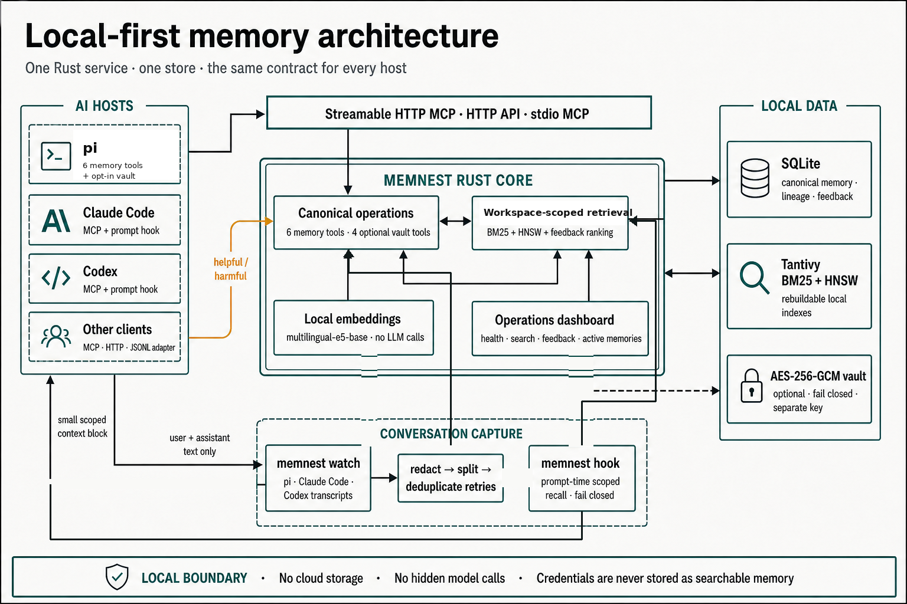

# memnest

<!-- markdownlint-disable MD013 -->

[한국어 README](README.ko.md)

Local memory for AI coding agents. Memnest stores durable memories and searchable conversation text on your machine, then exposes the same small tool contract to pi, Claude Code, Codex, and other MCP clients.

[](./LICENSE)


## What it does

- Stores manual memories, project decisions, preferences, and corrections.
- Searches with local BM25 and HNSW vector indexes.
- Preserves redacted user and assistant conversation text without LLM summarization.
- Records recall feedback so one useful or harmful result can affect future ranking.
- Keeps credentials in a separate AES-256-GCM vault.

The Rust core does not call an LLM. Embeddings run locally with `intfloat/multilingual-e5-base`.

## Architecture



Tool traffic, prompt-time recall, and transcript capture share one Rust service while keeping separate data paths. The mental model is small: a workspace holds one directory's memories, `playbook` holds rules shared by every workspace, and conversation history is searchable evidence rather than trusted instruction. SQLite is the source of truth. Tantivy and HNSW are derived indexes that the service can rebuild.

## Install

```bash
git clone https://github.com/Blue-B/memnest.git
cd memnest/core
cargo build --release
install -m755 target/release/memnest ~/.local/bin/memnest
memnest --data-dir ~/.memnest
```

The service, dashboard, HTTP API, and Streamable HTTP MCP endpoint share one address:

```text
http://127.0.0.1:3111
http://127.0.0.1:3111/mcp
```

Starting the service does not download anything. The embedding model is fetched on the first operation that needs it, which is the first write or the first search, so that call takes longer than the rest. Run `memnest --warmup-embedding` to pay that cost ahead of time. Linux, WSL, Windows service setup, backup, restore, and retention options are in [`docs/operations.md`](docs/operations.md).

## Connect an agent

### MCP

Point an MCP client at the running service:

```json
{
  "mcpServers": {
    "memnest": { "url": "http://127.0.0.1:3111/mcp" }
  }
}
```

Streamable HTTP is recommended because every client shares one server and one data directory. Use stdio only when that process owns the store. A second writer for the same data directory is rejected instead of racing the indexes:

```json
{
  "mcpServers": {
    "memnest": {
      "command": "/absolute/path/to/memnest",
      "args": ["--mcp", "--data-dir", "/home/you/.memnest"]
    }
  }
}
```

### pi

```bash
cd memnest/pi-extension
npm install
pi install .
```

The extension registers the six memory tools, adds workspace-scoped Autocontext, and provides `/memnest` for status. Vault tools are opt-in. See [`pi-extension/README.md`](pi-extension/README.md).

### HTTP and custom hosts

The HTTP API is available without MCP. [`adapters/generic-http`](adapters/generic-http) contains a dependency-free JSONL reference adapter.

## Tool contract

All hosts use six memory tools:

```text
memory_remember
memory_search
memory_get
memory_update
memory_delete
memory_feedback
```

The vault API is initialized locally, but model-facing secret tools are hidden by default. Set `MEMNEST_EXPOSE_SECRET_TOOLS=1` for a trusted agent process to add four tools:

```text
secret_set
secret_get
secret_list
secret_delete
```

Search is workspace-scoped. A client passes an absolute `cwd`, an explicit `project`, or `project=all` for a deliberate cross-project search. Every search returns a `recall_id`; feedback with both `recall_id` and `memory_id` changes only that returned memory. Delete moves a memory to trash instead of erasing it immediately.

### Workspace identity and legacy projects

An inferred workspace ID is a stable hash of the normalized absolute working directory. The path itself is not exposed as the public collection name, and `/work/client-a/api` cannot mix with `/personal/api`. Inferred searches include that workspace and `playbook`.

Existing basename collections remain readable as a legacy alias while only one registered workspace owns that basename. If a second `api` workspace appears, the ambiguous `api` alias is disabled for both instead of guessing where old rows belong. Pass an explicit `project` when you intentionally use a named legacy collection.

A memory saved with `supersedes=<id>` must replace an active memory in the same scope. Both changes happen in one SQLite transaction, and the old row moves to the hidden `_superseded` collection. Structured facts, rules, provenance, and corrections bypass semantic content deduplication so metadata is not discarded. `confidence` and `verified_at` remain client assertions and do not receive an automatic ranking bonus.

## Automatic context and conversation capture

`memnest hook` reads a host prompt event from stdin and prints a small workspace-scoped context block. If the working directory is unknown or the service is unavailable, it prints nothing and does not block the prompt. Retrieved text is marked as untrusted reference data. Transcript results are labeled as conversation evidence, and embedded markup is escaped before injection.

Claude Code hook example:

```json
{
  "hooks": {
    "UserPromptSubmit": [
      {
        "hooks": [
          { "type": "command", "command": "memnest hook" }
        ]
      }
    ]
  }
}
```

`memnest watch` is the single transcript capture path for pi, Claude Code, and Codex:

```bash
memnest watch
memnest watch --once
memnest watch --backfill
```

It stores visible user and assistant text after credential redaction. It skips system and developer prompts, reasoning, reminders, tool calls and results, images, and subagent sidechains. Long turns are split into ordered searchable chunks. Repeated utterances stay distinct, while retries of the same transcript event remain idempotent.

The watcher follows the known transcript directories and stores offsets in `<data-dir>/watch-state.json`. A file offset advances only after all chunks were stored or repaired. `--backfill` imports earlier history; the default starts from new transcript data.

## Storage and dashboard

Memnest keeps its state under the selected data directory, normally `~/.memnest`:

```text
memory.db       SQLite records, workspace registry, and pending index work
text_index/     rebuildable Tantivy BM25 index
vectors/        rebuildable HNSW vector index
models/         local embedding model
master.key      vault key
archive/        plaintext JSONL of hard-deleted memories
watch-state.json
```

The dashboard at `http://127.0.0.1:3111` shows stored memories, searches, latency, processing failures, and recall feedback.

## Security

The server binds to `127.0.0.1` by default. A non-local bind is refused unless `MEMNEST_TOKEN` is non-empty, and clients must then send `Authorization: Bearer <token>`.

Regular memory text is local but not encrypted at rest. Credential-shaped strings are redacted before storage, and the legacy `raw_chunk` field is not writable through public memory operations. Secrets belong in the vault, not in searchable memory. New stores create `<data-dir>/master.key` with private permissions and use AES-256-GCM. New ciphertext is bound to its secret key or server name, while legacy `$enc$` rows remain readable. Startup fails closed when stored ciphertext does not match the available key. Back up `master.key` separately.

Deletion is not erasure. A deleted memory sits in trash for 30 days, and when trash is finally hard-deleted the full record is appended in plaintext to `<data-dir>/archive/YYYY-MM.jsonl`. Set `MEMNEST_ARCHIVE=0` to stop writing those files, and remove the existing `archive/` directory yourself if the text must be gone.

Do not expose port 3111 directly to the internet. The rest is in [`SECURITY.md`](SECURITY.md).

## Repository

| Directory | Role |
| --- | --- |
| [`core/`](core) | Rust server, CLI, indexes, MCP, vault, watcher, and dashboard |
| [`pi-extension/`](pi-extension) | Thin pi adapter and workspace-scoped Autocontext |
| [`adapters/`](adapters) | Integration contract and generic HTTP adapter |
| [`journal/`](journal) | Optional Markdown and git audit mirror, not a database backup |

Development checks:

```bash
(cd core && cargo test --locked -- --test-threads=1)
(cd pi-extension && npm install && npm run build && npm run smoke)
(cd adapters/generic-http && node test.mjs)
```

Engine attributions are in [`core/THIRD_PARTY_NOTICES.md`](core/THIRD_PARTY_NOTICES.md). Contributions follow [`CONTRIBUTING.md`](CONTRIBUTING.md).

## License

MIT © Blue-B
