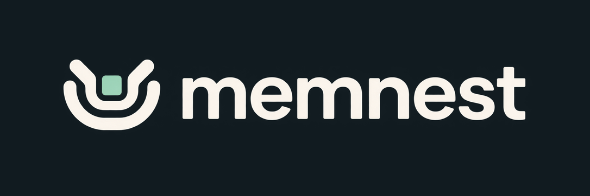
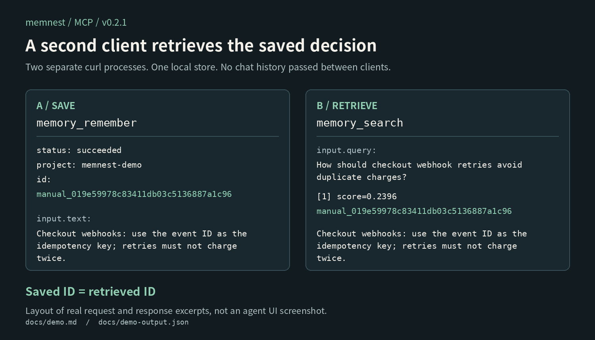
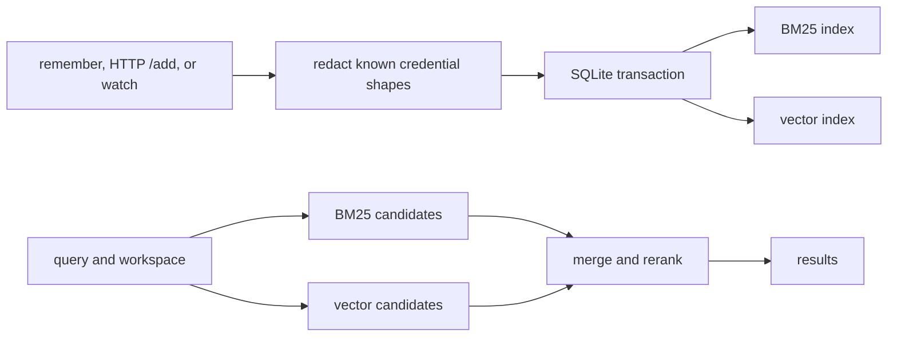

# memnest

<!-- markdownlint-disable MD013 MD033 -->



[한국어 README](README.ko.md)

Save a coding decision through one client and retrieve the same record from another client, with both connected to one local Memnest service. Memnest keeps memories and conversation history on your machine for pi, Claude Code, Codex, and other MCP clients.

[](https://github.com/Blue-B/memnest/releases/latest)
[](./LICENSE)


[](https://www.npmjs.com/package/pi-memnest)

## See the exact result



The image is an earlier MCP-to-MCP run. In the reproducible demo below, a curl process writes a decision through MCP over Streamable HTTP. A second curl process, with no state from the first, finds the same ID and exact text through Memnest's JSON HTTP API. These are real supported client surfaces against one disposable store.

```bash
./docs/run-independent-client-demo.sh /tmp/memnest-demo-evidence
cat /tmp/memnest-demo-evidence/transcript.txt
```

The script needs a running service and `memnest` executable but no agent account. It also passes a synthetic fixture in Codex's supported JSONL transcript shape through `memnest watch`. It preserves request and response bodies, a checksum manifest, a plain-text terminal transcript, and an editorially paced ~45-second asciicast. See the [checked-in evidence](docs/demo-evidence/), [terminal cast](docs/demo-evidence/demo.cast), and [full reproduction notes](docs/demo.md).

This proves transport-level persistence and retrieval. It does **not** prove that Claude Code, Codex, pi, or another autonomous agent will choose to save, search, trust, or apply the result.

## Quick start

Linux x86_64 and aarch64 can install the latest release without a Rust toolchain:

```bash
curl -fsSL https://raw.githubusercontent.com/Blue-B/memnest/main/core/scripts/install.sh \
  -o /tmp/memnest-install.sh
# Review the script before running it.
bash /tmp/memnest-install.sh --user
curl -fsS http://127.0.0.1:3111/health
```

Windows, WSL, source builds, uninstall, backup, restore, and configuration are in the [operations guide](docs/operations.md).

The first write or search downloads the local embedding model. The default model uses about 1.1 GB on disk and can approach 1.9 GB of memory while embedding.

## Benchmark status

No comparative benchmark currently shows that Memnest retrieves more accurately or runs faster than other memory tools. The checked-in demo above verifies one write-and-retrieve path; it is not a quality or performance benchmark.

## Connect a client

### pi

Start the core service first, then install the adapter:

```bash
pi install npm:pi-memnest
```

The adapter registers the memory tools, adds workspace-scoped Autocontext, and provides `/memnest` status. See the [pi extension guide](pi-extension/README.md).

### MCP

Point a Streamable HTTP MCP client at the running service:

```json
{
  "mcpServers": {
    "memnest": { "url": "http://127.0.0.1:3111/mcp" }
  }
}
```

The same service also exposes a JSON HTTP API at `http://127.0.0.1:3111`. Stdio MCP and custom-host examples are in the [adapter guide](adapters/README.md).

## What it does

| Capability | Behavior |
| --- | --- |
| Durable memory | Saves decisions, preferences, corrections, facts, and rules across sessions. |
| Conversation capture | Stores visible user and assistant text after credential redaction, without LLM summarization. |
| Local search | Combines BM25 keyword matching with multilingual vector similarity. |
| Workspace scope | Keeps each directory separate, with `playbook` for rules shared everywhere. |
| Secret vault | Stores credentials in AES-256-GCM ciphertext outside searchable memory. |

A small `CLAUDE.md` or `AGENTS.md` is still the simplest place for rules that should load every time. Memnest is for material that grows across projects and sessions and should be retrieved only when it matches the current query.

The Rust service is the only engine. SQLite is the source of truth, the search indexes are rebuildable, embeddings run locally, and no LLM is called.

## Use it

Every host uses the same five memory tools:

```text
memory_remember
memory_search
memory_get
memory_update
memory_delete
```

For example, an agent can save a shared rule and find it in a later session:

```text
memory_remember(text="Use port 5433 for staging.", project="playbook")
memory_search(query="staging database port", project="playbook")
```

Omit `project` when the host supplies the current working directory. That searches the current workspace plus `playbook`. Use `project=all` only for a deliberate cross-project search. Delete moves a memory to trash rather than erasing it immediately.

Vault tools are hidden from model-facing clients by default. A trusted process can opt in with `MEMNEST_EXPOSE_SECRET_TOOLS=1`.

## Automatic recall and capture

`memnest hook` gives Claude Code and Codex a small context block before a prompt. It prints nothing if the service or workspace is unavailable, so it never blocks the prompt.

```json
{
  "hooks": {
    "UserPromptSubmit": [
      { "hooks": [{ "type": "command", "command": "memnest hook" }] }
    ]
  }
}
```

`memnest watch` follows pi, Claude Code, and Codex transcripts and stores visible conversation text:

```bash
memnest watch
memnest watch --backfill
```

It skips system and developer prompts, reasoning, tool traffic, images, and subagent sidechains. Captured transcripts are retained unless deleted. Retention and recovery details are in the [operations guide](docs/operations.md).

## How search and storage work




Every write reaches SQLite before the derived indexes. Interrupted index work is replayed at startup, and missing indexes can be rebuilt from `memory.db`.

Three behaviors matter when using the results:

- Memnest does not read your code, so it cannot detect that a saved fact became outdated. Save the replacement with `supersedes=<id>` when the fact changes.
- Search ranks the nearest memories. It cannot prove that the store contains an answer, so verify a result before acting on it.
- Explicit search includes captured transcripts for questions about earlier conversations. Automatic context only admits deliberate or consolidated memories, so an unfinished “tried X” note cannot silently steer the next prompt.

## Compared with built-in memory

If you only need one tool to remember earlier chats, start with its built-in memory. Memnest is for retrieving a decision saved through Claude Code from pi or Codex, or keeping a searchable store of memories across workspaces under your own control.

| Option | What it already provides | Why choose Memnest |
| --- | --- | --- |
| [ChatGPT memory](https://help.openai.com/en/articles/8590148), [Claude chat memory](https://support.claude.com/en/articles/11817273-use-claude-s-chat-search-and-memory-to-build-on-previous-context) | Reuse prior conversations and memories in later responses within each product. | Let connected coding tools query the same local store, separate from a chat product's own memory. |
| [Claude Code memory](https://code.claude.com/docs/en/memory), `CLAUDE.md`, `AGENTS.md` | Claude Code already saves auto memory in local Markdown. Instruction files are good for rules that should load every time. | Search growing decisions and transcripts by keyword and meaning, using the same API from different tools. Local storage alone is not unique to Memnest. |
| [MCP reference Memory Server](https://github.com/modelcontextprotocol/servers/tree/main/src/memory) | Stores entities, relations, and observations in a local knowledge graph. | Retrieve workspace-scoped decisions and conversation text rather than maintain a graph. |
| Memory layers such as [Mem0](https://docs.mem0.ai/open-source/overview) | Offer self-hosting and configurable LLMs, embeddings, and storage. | Use one Rust service with local embeddings and BM25, no LLM calls, coding-tool adapters, and transcript capture. |

There is no comparative benchmark showing that Memnest retrieves more accurately or runs faster than these alternatives. Its case is the combination of local storage, a shared API, workspace search, and transcript capture. A few short rules, or an existing memory tool that already works for you, do not need another service.

Memnest does not automatically import or synchronize ChatGPT's or Claude's built-in memories. Clients need to be connected. If retrieved text is sent to a cloud model, that provider receives it. You also take on service operation and the local model's disk and RAM costs.

## Data and security

The server binds to `127.0.0.1` by default. Do not expose port 3111 directly to the internet.

Regular memories are local but are not encrypted at rest. Redaction catches known credential shapes, not every possible secret, so credentials belong in the vault. Deleted records remain recoverable in trash for 30 days and may also exist in archive JSONL. Read [SECURITY.md](SECURITY.md) before storing sensitive material.

Back up `memory.db` together with `master.key`. The database cannot be rebuilt, while the text and vector indexes can.

## Documentation

- [Operations](docs/operations.md): install, configuration, retention, backup, restore, and CLI reference
- [Security](SECURITY.md): threat model, vault, redaction, deletion, and network binding
- [Design decisions](docs/design-decisions.md): reasons behind the shipped architecture
- [pi extension](pi-extension/README.md): pi setup and Autocontext behavior
- [Adapters](adapters/README.md): MCP, HTTP, and custom-host integration
- [Contributing](CONTRIBUTING.md): development setup and checks

Memnest is in the `0.2.x` series. Back up the database before upgrading and check the [release notes](https://github.com/Blue-B/memnest/releases) for compatibility changes.

## License

MIT © Blue-B
