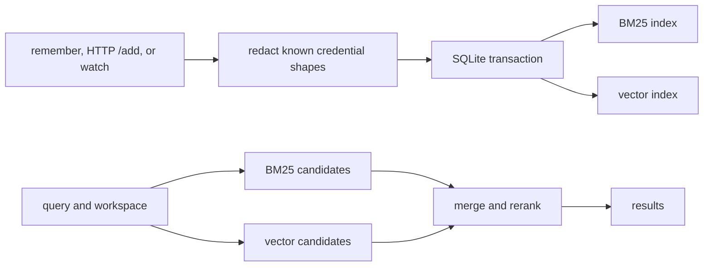

# memnest

<!-- markdownlint-disable MD013 -->

[한국어 README](README.ko.md)

Your coding agent forgets the last session. Memnest keeps selected memories and conversation history on your machine, then makes them available to pi, Claude Code, Codex, and other MCP clients.

[](https://github.com/Blue-B/memnest/releases/latest)
[](./LICENSE)


[](https://www.npmjs.com/package/pi-memnest)


## What it does

| Capability | Behavior |
| --- | --- |
| Durable memory | Saves decisions, preferences, corrections, facts, and rules across sessions. |
| Conversation capture | Stores visible user and assistant text after credential redaction, without LLM summarization. |
| Local search | Combines BM25 keyword matching with multilingual vector similarity. |
| Workspace scope | Keeps each directory separate, with `playbook` for rules shared everywhere. |
| Secret vault | Stores credentials in AES-256-GCM ciphertext outside searchable memory. |

A small `CLAUDE.md` or `AGENTS.md` is still the simplest place for rules that should load every time. Memnest is for material that grows across projects and sessions and should be retrieved only when it matches the current query.

The Rust service is the only engine. SQLite is the source of truth, the search indexes are rebuildable, embeddings run locally, and no LLM is called.

## Quick start

Linux x86_64 and aarch64 can install the latest release without a Rust toolchain:

```bash
curl -fsSL https://raw.githubusercontent.com/Blue-B/memnest/main/core/scripts/install.sh \
  -o /tmp/memnest-install.sh
# Review the script before running it.
bash /tmp/memnest-install.sh --user
curl -fsS http://127.0.0.1:3111/health
```

Windows, WSL, source builds, uninstall, backup, restore, and configuration are in the [operations guide](docs/operations.md).

The first write or search downloads the local embedding model. The default model uses about 1.1 GB on disk and can approach 1.9 GB of memory while embedding.

### pi

Start the core service first, then install the adapter:

```bash
pi install npm:pi-memnest
```

The adapter registers the memory tools, adds workspace-scoped Autocontext, and provides `/memnest` status. See the [pi extension guide](pi-extension/README.md).

### MCP

Point a Streamable HTTP MCP client at the running service:

```json
{
  "mcpServers": {
    "memnest": { "url": "http://127.0.0.1:3111/mcp" }
  }
}
```

The same service also exposes a JSON HTTP API at `http://127.0.0.1:3111`. Stdio MCP and custom-host examples are in the [adapter guide](adapters/README.md).

## Use it

Every host uses the same five memory tools:

```text
memory_remember
memory_search
memory_get
memory_update
memory_delete
```

For example, an agent can save a shared rule and find it in a later session:

```text
memory_remember(text="Use port 5433 for staging.", project="playbook")
memory_search(query="staging database port", project="playbook")
```

Omit `project` when the host supplies the current working directory. That searches the current workspace plus `playbook`. Use `project=all` only for a deliberate cross-project search. Delete moves a memory to trash rather than erasing it immediately.

Vault tools are hidden from model-facing clients by default. A trusted process can opt in with `MEMNEST_EXPOSE_SECRET_TOOLS=1`.

## Automatic recall and capture

`memnest hook` gives Claude Code and Codex a small context block before a prompt. It prints nothing if the service or workspace is unavailable, so it never blocks the prompt.

```json
{
  "hooks": {
    "UserPromptSubmit": [
      { "hooks": [{ "type": "command", "command": "memnest hook" }] }
    ]
  }
}
```

`memnest watch` follows pi, Claude Code, and Codex transcripts and stores visible conversation text:

```bash
memnest watch
memnest watch --backfill
```

It skips system and developer prompts, reasoning, tool traffic, images, and subagent sidechains. Captured transcripts are retained unless deleted. Retention and recovery details are in the [operations guide](docs/operations.md).

## How search and storage work



Every write reaches SQLite before the derived indexes. Interrupted index work is replayed at startup, and missing indexes can be rebuilt from `memory.db`.

Two behaviors matter when using the results:

- Memnest does not read your code, so it cannot detect that a saved fact became outdated. Save the replacement with `supersedes=<id>` when the fact changes.
- Search ranks the nearest memories. It cannot prove that the store contains an answer, so verify a result before acting on it.

## Data and security

The server binds to `127.0.0.1` by default. Do not expose port 3111 directly to the internet.

Regular memories are local but are not encrypted at rest. Redaction catches known credential shapes, not every possible secret, so credentials belong in the vault. Deleted records remain recoverable in trash for 30 days and may also exist in archive JSONL. Read [SECURITY.md](SECURITY.md) before storing sensitive material.

Back up `memory.db` together with `master.key`. The database cannot be rebuilt, while the text and vector indexes can.

## Documentation

- [Operations](docs/operations.md): install, configuration, retention, backup, restore, and CLI reference
- [Security](SECURITY.md): threat model, vault, redaction, deletion, and network binding
- [Design decisions](docs/design-decisions.md): reasons behind the shipped architecture
- [pi extension](pi-extension/README.md): pi setup and Autocontext behavior
- [Adapters](adapters/README.md): MCP, HTTP, and custom-host integration
- [Contributing](CONTRIBUTING.md): development setup and checks

Memnest is in the `0.1.x` series. Back up the database before upgrading and check the [release notes](https://github.com/Blue-B/memnest/releases) for compatibility changes.

## License

MIT © Blue-B
