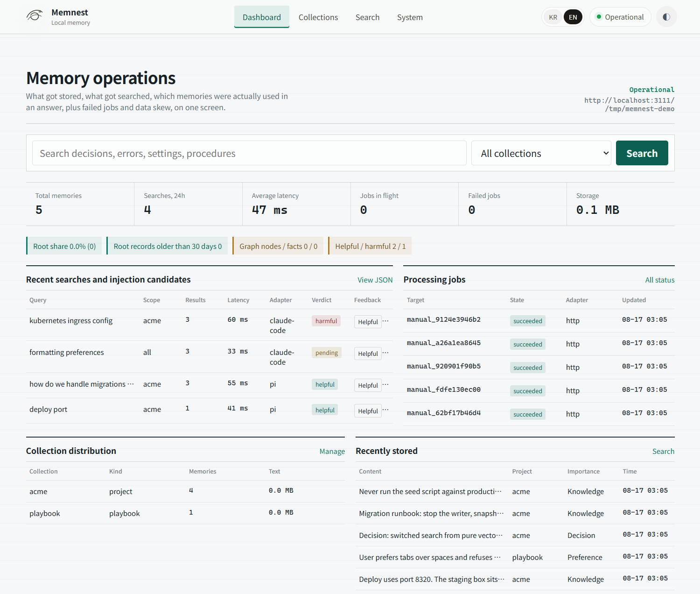
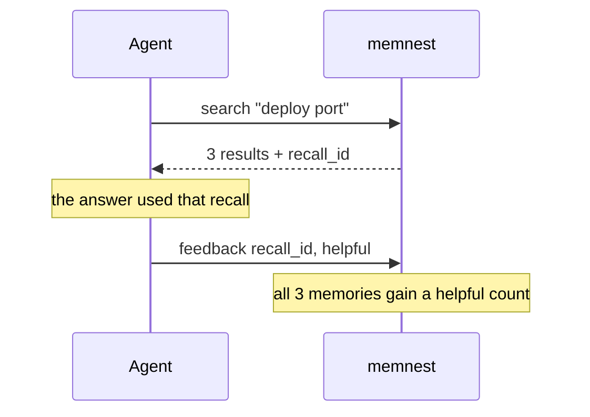
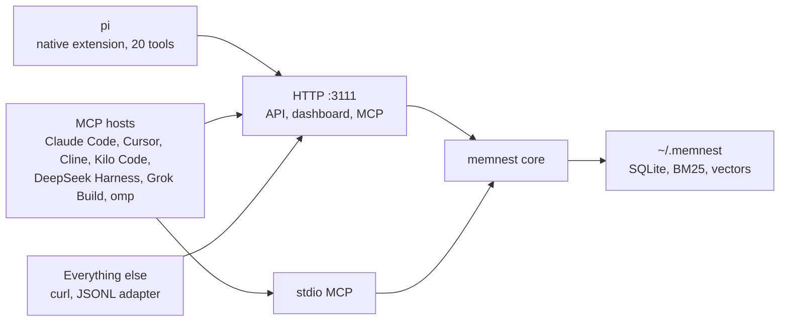
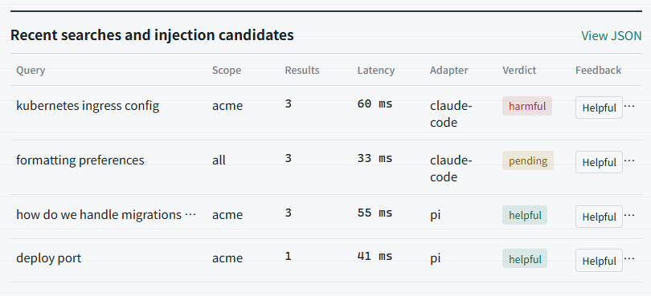
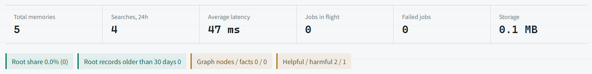

# memnest

<!-- markdownlint-disable MD013 -->

[한국어 README](README.ko.md)

**Local memory for AI coding agents.** A single Rust binary that stores what your agent learned, retrieves it on demand, and shows you whether the recall actually helped.

[](./LICENSE)




## Why

Your agent session ends and the project decisions, your preferences, and every correction go with it. Next session you explain the same constraints again.

Hosted memory services keep your project history on their servers. A vector database stores embeddings but cannot tell you which memory was used or why retrieval missed. memnest keeps the store in a directory on your machine, serves it over HTTP and MCP, and logs every recall so retrieval quality is something you inspect instead of guess at.

## Run it

```bash
git clone https://github.com/Blue-B/memnest.git
cd memnest/core && cargo build --release
./target/release/memnest --data-dir ~/.memnest
```

Service and dashboard: **`http://127.0.0.1:3111`**.

The rest of this page calls the binary by name, which needs it on your `PATH`:

```bash
install -m755 target/release/memnest ~/.local/bin/memnest
```

Then `memnest status` prints health, the dashboard link, and the data directory.

Nothing is published to npm or crates.io yet, so every install is from a checkout. New installs use `~/.memnest`, and an existing `~/.factory/memories` store keeps being used until you migrate. The build produces one executable (35 MB on linux x86_64, ONNX runtime statically linked), so there is no sidecar daemon or separate runtime to install. The first run downloads the embedding model intfloat/multilingual-e5-base into `~/.memnest/models`, which is 1.1 GB.

## Store, search, rate

```bash
curl -s http://127.0.0.1:3111/add \
  -H 'content-type: application/json' \
  -d '{"text":"Deploy uses port 8320","project":"acme","metadata":{"importance":"knowledge"}}'

curl -s http://127.0.0.1:3111/search \
  -H 'content-type: application/json' \
  -d '{"query":"deploy port","project":"acme","n_results":3}'

curl -s http://127.0.0.1:3111/feedback \
  -H 'content-type: application/json' \
  -d '{"recall_id":"recall_...","outcome":"helpful"}'
```

Every search returns a `recall_id`. Feedback applies to that whole search rather than to one row: every memory the search returned takes the helpful or harmful count. That loop is the part a vector store does not give you.



Three callers can rate a recall: the Helpful and Harmful buttons on the dashboard (a person), the `memory_feedback` tool (the agent itself), and `POST /feedback` (a script). The effect is capped at ±0.10 of the ranking score, so feedback breaks near ties instead of overriding relevance.

The first write is slower because fastembed downloads the embedding model. `/add` reports `succeeded` or `deduplicated` only after the record is stored and indexed.

## Connect your agent

Three ways in. Pick whichever your host supports.



All 24 MCP tools behave the same in every host. MCP defines tool calls the model decides to make, not hooks into a host's session events, so injection and logging come from two subcommands instead: `memnest hook` and `memnest watch`, described under [automatic memory](#automatic-memory) below. The pi extension bundles the same behaviour plus the `/memnest` command.

### pi, native extension

```bash
cd memnest/pi-extension && npm install && pi install .
```

Autocontext runs in `balanced` mode by default, which injects a small memory card only when the prompt carries a risk signal: recalling earlier work, credentials, something missing or broken, cost, or configuration. The trigger patterns cover English and Korean. Set `MEMNEST_AUTOCONTEXT_MODE=aggressive` to inject on every topic shift instead. `MEMNEST_URL` changes the address, `MEMNEST_TOKEN` sets bearer auth. Details in [`pi-extension/README.md`](./pi-extension/README.md).

### MCP hosts

Two transports, and the HTTP one is preferred.

**Streamable HTTP (recommended).** The running service answers API, dashboard, and MCP traffic on the same port, so several hosts share one process and one store, and the dashboard keeps working.

```json
{
  "mcpServers": {
    "memnest": { "url": "http://127.0.0.1:3111/mcp" }
  }
}
```

`POST /mcp` answers `initialize`, `tools/list`, and `tools/call` with a single JSON response, returns 202 for notifications, and 405 for `GET`.

**stdio.** The client spawns its own memnest child process, which then owns the data directory. Use it when exactly one host talks to that store, because a spawned writer plus the dashboard service means two writers on the same files.

```json
{
  "mcpServers": {
    "memnest": {
      "command": "/absolute/path/to/memnest",
      "args": ["--mcp", "--data-dir", "/home/you/.memnest"]
    }
  }
}
```

Verified from vendor docs: Claude Code, Cursor, Cline, Kilo Code (`kilo.jsonc` `mcp` key), DeepSeek Harness (`@deepseek-ai/dsh-mcp-client`), Grok Build (`grok mcp add`), and omp ([oh-my-pi](https://github.com/can1357/oh-my-pi)), whose extension manifests take an `mcpServers` field, though its bundled `@oh-my-pi/pi-mnemopi` engine already covers the same ground. Each host keeps that config in its own file.

## Automatic memory

Searching only helps when the agent decides to search. These two subcommands close that gap without a per-host extension.

**`memnest hook` injects context before a prompt.** It reads the host's hook payload on stdin, asks the running service for a context pack, and writes the reply in the shape that host expects. Claude Code takes it in three lines:

```json
{ "hooks": { "UserPromptSubmit": [{ "hooks": [{ "type": "command", "command": "memnest hook" }] }] } }
```

The payload shape decides the reply, so any host whose command hook appends stdout works with the same command; `--format` pins it when you would rather be explicit. It never blocks a prompt: if the service is down or slow it prints nothing, exits 0, and reports the reason on stderr.

**`memnest watch` records conversations with no host configuration at all.** It is the single automatic capture path for Claude Code, pi, and Codex session transcripts. It stores redacted user and assistant text directly, without summarization or extraction.

```bash
memnest watch                  # follow the known transcript directories
memnest watch --once           # single pass, useful in a cron job
memnest watch --backfill       # import existing history, not just new turns
```

System and developer prompts, reminders, tool calls and results, reasoning, images, and subagent sidechains are skipped, so the store gets the visible conversation rather than the machinery. Long turns are split into ordered searchable chunks without truncation, and distinct repeated turns remain distinct. Individual JSONL records are read with an explicit 16 MiB allocation ceiling; any record above that hard safety bound is consumed and skipped without allocating its full body. Progress lives in `<data-dir>/watch-state.json` as a byte offset per file; an offset advances only after every chunk is stored or confirmed as an idempotent retry. Pass `RUST_LOG=info` to see what it is doing.

### Everything else

MCP is optional. The HTTP API shown above is the whole contract, so any host that can send a POST can store and search memories, including editors with no MCP support, shell scripts, CI jobs, and your own glue code. The JSONL adapter in [`adapters/`](./adapters) is a worked example of mapping host events onto it. Adapters send `adapter` and `adapter_version` on every call, so their traffic and failures stay visible in the dashboard.

## The dashboard

Same port as the API. It answers what a memory store usually cannot: what got stored, what got searched, and whether the recall helped.



Each row is one real retrieval: query, result count, latency, which adapter asked, and the recorded verdict.



Totals, 24-hour search count, latency, in-flight and failed jobs, disk use. Failed writes surface here instead of disappearing into a log file.

## What you get

| Area | What is implemented |
| --- | --- |
| Retrieval | Hybrid BM25 + HNSW vector search, project filters, nearest-neighbor queries, `recall_id` on every search |
| Feedback loop | Helpful and harmful outcomes persist per memory and feed the ranking score, capped at ±0.10 |
| Structured memory | Optional record, fact, rule, procedure kinds with confidence, provenance, verification metadata |
| Context assembly | Character-bounded context packs, counted in Unicode characters so non-Latin text is not truncated early |
| Observability | 90 days of recall events and processing jobs with latency, adapter identity, and outcomes |
| Recovery | Deletes move to trash, restore reindexes them, hard deletes are archived to monthly JSONL first |
| Secret storage | Separate vault encrypts credential values with AES-256-GCM using a local master key |

memnest is a memory engine, not an agent runtime. It does not run your agent, manage prompts, or replace compaction.

Service install on Linux, WSL, and Windows, backup and restore, retention, and the CLI reference live in the [operations guide](docs/operations.md).

## Repository layout

| Directory | Package | Role |
| --- | --- | --- |
| [`core/`](./core) | `memnest` 0.2.0 | **Required.** HTTP API, MCP server, indexes, lifecycle, vault, dashboard |
| [`pi-extension/`](./pi-extension) | `pi-memnest` 0.6.0 | pi integration: 20 tools, `/memnest`, autocontext, feedback, opt-in AutoLog |
| [`adapters/`](./adapters) | contract | Integration contract and reference JSONL adapter |
| [`journal/`](./journal) | `memnest-journal` 0.1.0 | Optional Markdown and git audit mirror, not a database backup |
| [`learn/`](./learn) | `memnest-learn` 0.1.0 | Optional pi learning layer. **Experimental**, no docs yet |

## Security

The HTTP server binds to `127.0.0.1`. A non-local bind is refused unless `MEMNEST_TOKEN` is set, and requests must then send `Authorization: Bearer <token>`. Do not expose port 3111 to the internet directly.

Memory text is stored locally but **is not encrypted at rest**. Incoming text is scanned for credential-shaped strings and redacted, but that is a safety net, not a place to put secrets. Use the vault for those: memnest creates `<data-dir>/master.key` on startup and uses it for AES-256-GCM secret values. Confirm that file exists before relying on vault encryption, because the crypto helper falls back to stored plaintext when no key is available.

Engine attributions are in [`core/THIRD_PARTY_NOTICES.md`](./core/THIRD_PARTY_NOTICES.md).

## Contributing

Run the checks in the [operations guide](docs/operations.md#development-checks) for the component you touched. Issues and pull requests go to the [memnest repository](https://github.com/Blue-B/memnest/issues).

## License

MIT © Blue-B
